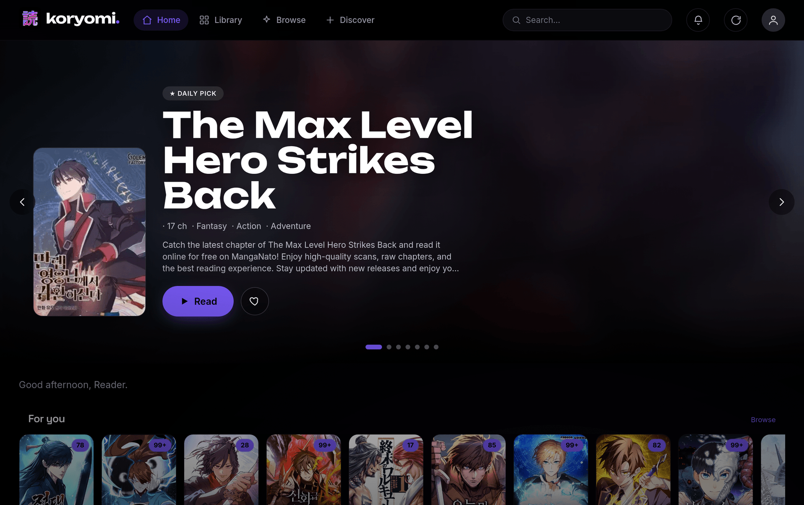
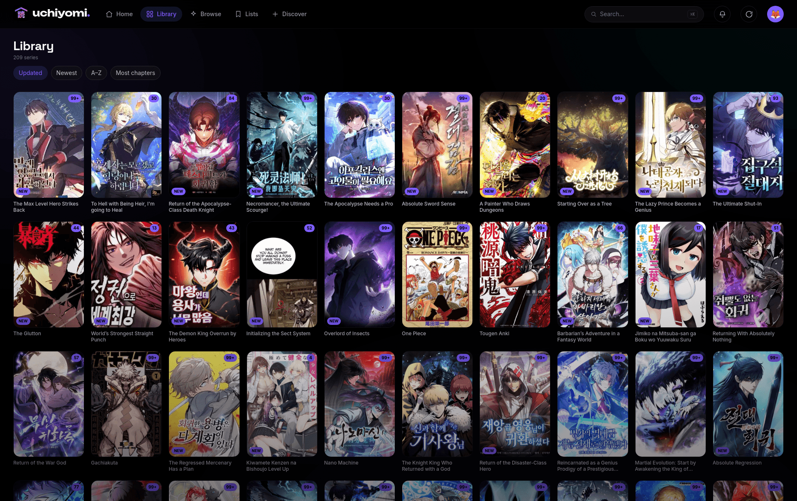

# Yomi

A self-hosted, installable (PWA) manga / manhwa reader with a true-black OLED interface and a vertical-scroll
webtoon reader as the centerpiece. Point it at your own CBZ library and read on any device.



Yomi is a **bring-your-own-library reader** — like Komga / Kavita / Calibre-web, it reads comics *you* supply.
It bundles **MangaDex** (the official public API) plus generic engines for the common manga-site families, so
you can also add sources by pasting a site's URL — but it ships with **no specific sites baked in**; you add the
ones you want.

> 📖 **[Full usage guide →](docs/USAGE.md)** — every screen walked through with screenshots (library, reader,
> Discover, admin, security, offline).

## Features

- **Vertical webtoon reader** — continuous multi-chapter scroll, pinch/double-tap zoom, AMOLED/sepia themes,
  per-series memory, auto-hiding chrome, keyboard nav on desktop.
- **Library** — fast scanner for **CBZ, CBR, and loose image folders** (reads `ComicInfo.xml`), cover-art
  ambient theming, genres, an Updates feed with new-chapter badges, and discovery rails (For You / trending /
  similar).
- **Multi-user** — username + password accounts, per-user reading progress / favorites / history, avatars,
  streaks, and a "household" leaderboard.
- **Offline** — installable PWA with offline downloads + smart auto-sync of favorites.
- **Security** — argon2id passwords, JWT + rotating refresh tokens, login lockout, an audit log,
  session/device management, and optional TOTP two-factor auth.
- **Admin** — a Jellyfin-style panel: members & permissions, provider health, scheduled tasks, activity feed,
  active sessions, and server settings (name, open registration, auto-update interval).



## Why Yomi?

Most self-hosted manga tools make you pick a side. A **library server** (Komga, Kavita) reads files you supply
but can't fetch new chapters and ships a fairly utilitarian reader. A **source app** (Tachiyomi / Mihon,
Suwayomi) fetches chapters but is Android-only or wraps them in a basic web UI. Yomi is the rare one that does
**both**, in a single app that's actually a pleasure to use:

- **Server *and* sources in one.** Own your library *and* pull new chapters — no Komga-plus-Suwayomi-plus-a-
  reader Frankenstein to stitch together.
- **A reader you'll actually want to open.** True-black OLED, with a **webtoon-first** vertical reader
  (continuous multi-chapter scroll, pinch-zoom, themes, per-series memory) — not a long-strip mode bolted onto a
  page-turn comics viewer.
- **Installable, offline, every device.** A real PWA — add to home screen, read offline, no app store — on
  phone, tablet, or desktop from one codebase.
- **Built for a household.** Per-user progress, favorites, history, avatars, streaks, a leaderboard — plus the
  security most self-hosted manga tools skip: **TOTP two-factor**, login lockout, an audit log, and
  session/device management, all behind a Jellyfin-style admin panel.
- **Add a source by pasting a URL.** Auto-detect figures out the engine — no extension repos to wire up.

| | Yomi | Komga / Kavita | Tachiyomi / Mihon | Suwayomi |
| --- | :---: | :---: | :---: | :---: |
| Self-hosted, multi-user server | ✅ | ✅ | ❌ *(Android app)* | ✅ |
| Fetches new chapters from sources | ✅ | ❌ *(you supply files)* | ✅ | ✅ |
| OLED design + webtoon-first reader | ✅ | basic | ✅ *(mobile)* | basic |
| Installable PWA + offline, any device | ✅ | partial | Android only | partial |
| Per-user progress + household features | ✅ | ✅ | ❌ | limited |
| 2FA · lockout · audit · sessions | ✅ | basic | ❌ | ❌ |
| Add a source by pasting a URL | ✅ | — | extensions | extension repos |

**Honest caveats** (narrower than they look): Komga/Kavita are more mature for general library management, and
Tachiyomi/Mihon list more individual sources. But Yomi reads **CBZ, CBR, and loose image folders** — it skips
PDF/EPUB *on purpose* (those are ebook formats; Yomi is built for image-based manga) — and its **three engines
each cover a whole *family* of sites** (most aggregators run Madara, MangaThemesia, or Manganato), so "add a
source by URL" reaches far more sites than the engine count suggests. Yomi's real edge is the *combination* — a
polished, installable, multi-user reader that also fetches — with webtoons as first-class.

## Architecture

| Service | What it is |
| --- | --- |
| `yomi-web` | Next.js static-export PWA on nginx; reverse-proxies `/api`, `/auth`, `/img` to the BFF (single origin) |
| `yomi-bff` | Fastify + TypeScript API: auth, catalog over the CBZ library, disk image cache, the source loader |
| `yomi-db` | Private Postgres (no host port) |
| `yomi-flaresolverr` | Optional headless-Chrome Cloudflare solver, used only by Cloudflare-protected source plugins |

## Install

**Requirements:** Docker + Docker Compose, and a manga library on disk laid out as `<series>/<chapter>`, where
each chapter is a `.cbz`, a `.cbr`, or a folder of images (an archive may carry a `ComicInfo.xml` for metadata).
Everything else runs in containers — no Node, no database, nothing to install on the host.

```bash
git clone https://github.com/AngeloSha/yomi.git
cd yomi
cp .env.example .env
# edit .env and point LIBRARY_PATH at your library (mounted read-only), e.g.
#   LIBRARY_PATH=/path/to/your/manga
bash scripts/setup.sh        # generates DB/JWT secrets + your admin password, fixes volume perms, starts the stack
```

When it finishes, open **http://localhost:3000**, log in with the admin account you just created, and your
library appears. `setup.sh` starts four containers:

| Container | Role |
|---|---|
| `yomi-web` | the PWA (what you open in the browser) |
| `yomi-bff` | the API |
| `yomi-db` | private Postgres (never exposed) |
| `yomi-flaresolverr` | Cloudflare solver — **started automatically**; sources that need it use it with no config |

Prefer to wire it up by hand? After editing `.env`:

```bash
docker compose up -d             # build + start everything; app at http://localhost:3000
docker compose logs -f yomi-bff  # watch it boot
```

Change the port with `WEB_PORT` in `.env` (`WEB_PORT=8080` → http://localhost:8080).

### Serving it on a domain (HTTPS)

The committed compose is **standalone** — it publishes the app on a local port and creates its own private
networks, so a fresh clone just works. To put it on a public domain with TLS, front `yomi-web` with any reverse
proxy (Caddy, Traefik, Nginx Proxy Manager, …) and set `PUBLIC_ORIGIN` in `.env` to your URL. If your proxy
reaches containers over a shared Docker network, add a `docker-compose.override.yml` next to the compose file to
attach `yomi-web` to it — Compose loads it automatically:

```yaml
# docker-compose.override.yml  (server-specific; keep it out of git)
networks:
  proxy:
    external: true
services:
  yomi-web:
    networks: [yomi_app, proxy]   # keep yomi_app so it still reaches the API
```

## Sources (optional)

Yomi can fetch new chapters from external providers. It bundles a few **generic engines** — parsers for the
common manga-site families (Madara / MangaThemesia / Manganato) — but **no specific sites**. Nothing fetches
anything until *you* add a site:

**Admin → Providers → Add a site** — pick the engine, paste a site's homepage URL, done. It loads instantly
(no rebuild). The engines are generic parsers; you supply the URLs, and you're responsible for using them in
line with those sites' terms and your local law.

A handful of one-off, site-specific sources (e.g. an official API client) aren't engines and aren't bundled —
those live in a separate **yomi-sources** pack you can build and mount:

```bash
# .env
SOURCES_PATH=/path/to/yomi-sources/dist     # compiled .js plugins, mounted read-only at /sources
```

The reader scans `SOURCES_DIR` (`/sources`) at boot and registers every plugin it finds. Drop in or update a
plugin and hit **Admin → Providers → Reload** (`POST /api/admin/sources/reload`) — no rebuild. With no sites
added and no pack mounted, Yomi is just a clean reader for the library you already own.

## Configuration

Everything is in `.env` (see `.env.example`). Notably:

- `LIBRARY_BACKEND` — `owned` (read your CBZ library, default) or `komga` (read from a Komga server).
- `LIBRARY_PATH` — host path to your CBZ library (read-only mount at `/library`).
- `SOURCES_PATH` — host path to a built source pack (empty by default = no sources).
- `WEB_PORT` — host port the app is published on (default `3000`).
- `PUBLIC_ORIGIN` — the URL the app is served from (match your domain behind a reverse proxy).

## License

[MPL-2.0](LICENSE). Source plugins are **not** part of this repository; they fetch from third-party sites and
are your responsibility to use in line with those sites' terms and your local law.
