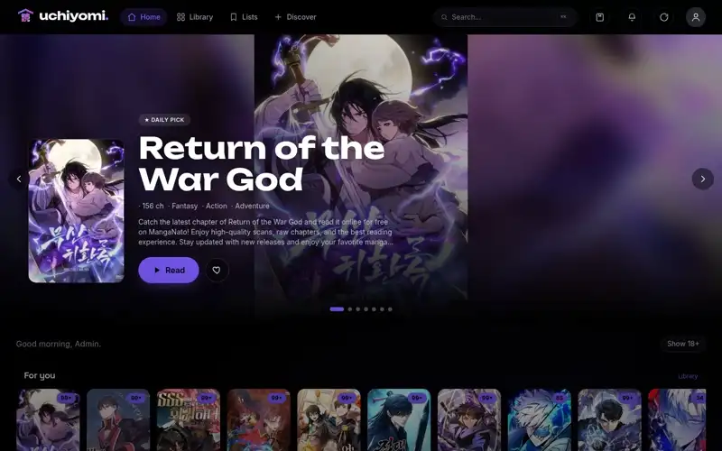
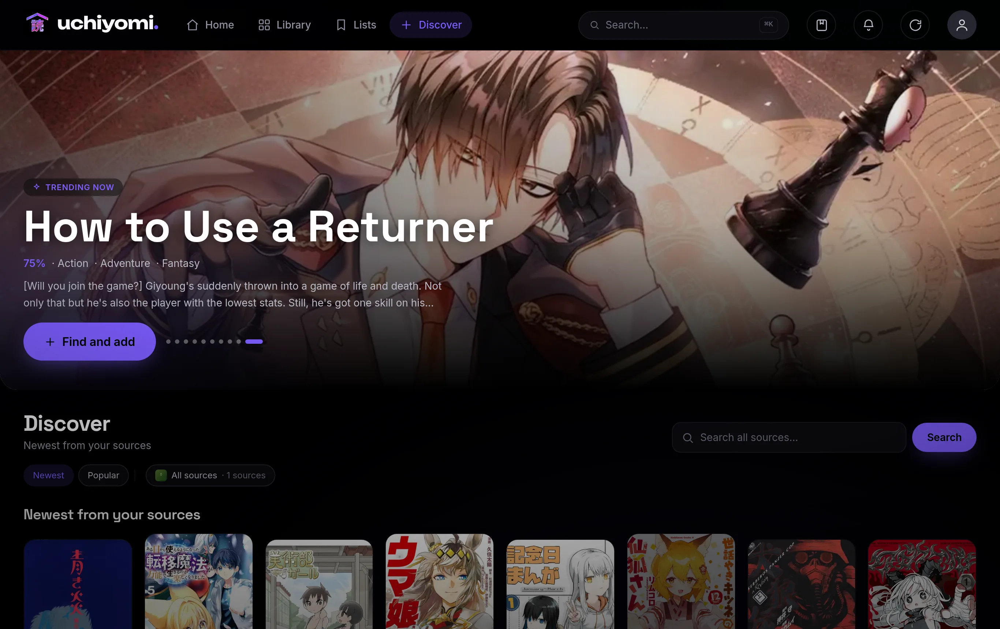
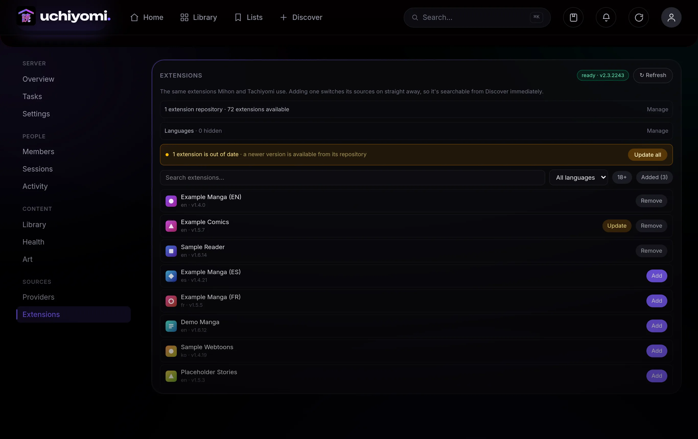
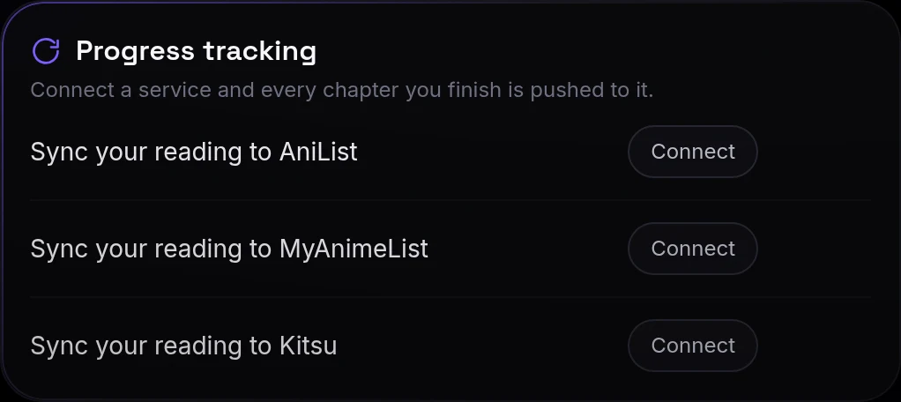
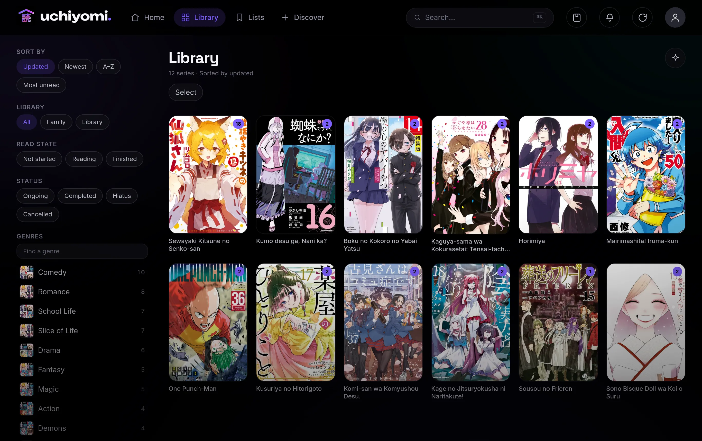
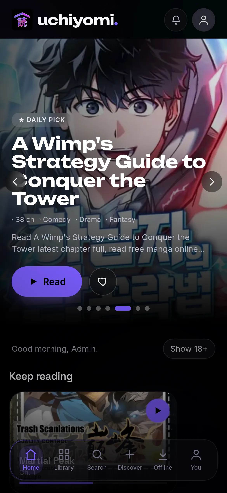
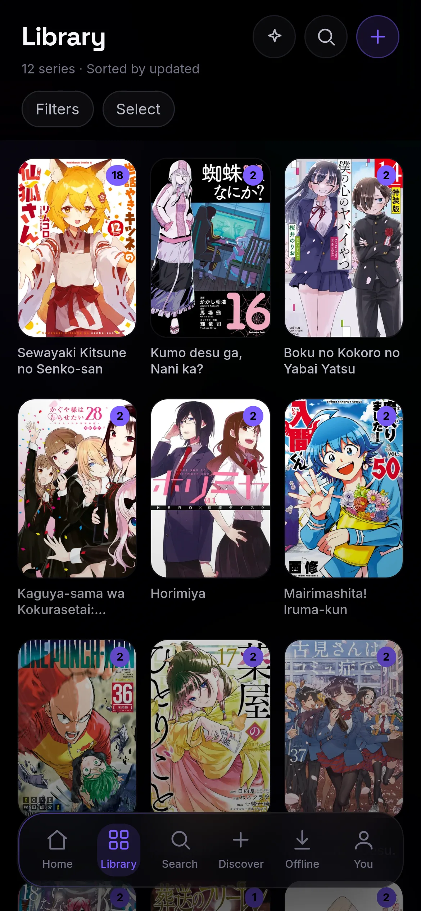
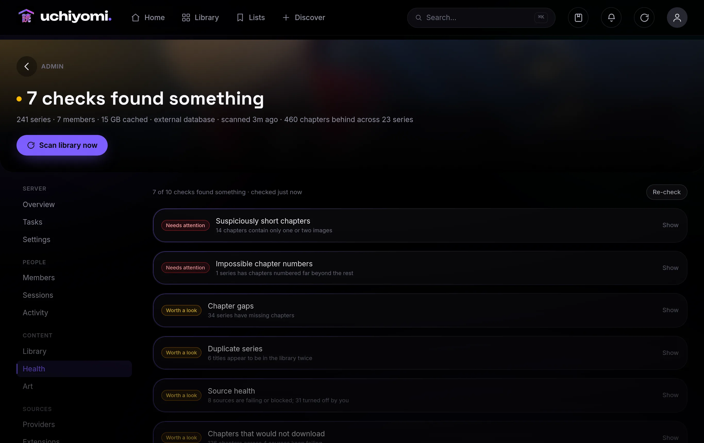

# Uchiyomi

*The all-in-one **\*arr stack** for manga: discover, grab, monitor, and read, self-hosted in one PWA.*

[](https://github.com/AngeloSha/uchiyomi/actions/workflows/ci.yml)
[](https://github.com/AngeloSha/uchiyomi/releases/latest)
[](LICENSE)
[](https://github.com/AngeloSha?tab=packages&repo_name=uchiyomi)

### 🌐 [**uchiyomi.com**](https://uchiyomi.com) · 🐙 [GitHub](https://github.com/AngeloSha/uchiyomi) · ☕ [Ko-fi](https://ko-fi.com/angeloshaheen) · 📜 [Changelog](CHANGELOG.md)

A self-hosted, installable (PWA) manga / manhwa reader with a true-black OLED interface and a vertical-scroll
webtoon reader as the centerpiece. Point it at your own CBZ library and read on any device.

[](https://uchiyomi.com)

Uchiyomi is a **bring-your-own-library reader**. Like Komga / Kavita / Calibre-web, it reads comics *you* supply.
It bundles **MangaDex** (the official public API) plus generic engines for the common manga-site families, so
you can also add sources by pasting a site's URL, but it ships with **no specific sites baked in**; you add the
ones you want.

> 📖 **[Full usage guide →](docs/USAGE.md)**: every screen walked through with screenshots (library, reader,
> Discover, admin, security, offline).

## One app instead of a stack

Self-hosting manga the usual way means a pile of services: an indexer, a grabber that watches for new
releases, a download client, a Cloudflare solver, and a media server to read it all, so four or five containers
and a weekend of compose files. **Uchiyomi folds the whole pipeline (discover → grab → monitor → serve → read)
into a single image.** Point it at your library, add sources by URL, and it does the rest.

| The usual self-hosted stack | Uchiyomi, built in |
| --- | --- |
| **Prowlarr / Jackett** — indexers & search | Add a source by pasting its URL (engine auto-detected) + bundled MangaDex, all searchable in Discover |
| **Sonarr / Radarr** — grab + watch for new releases | Add to library, then a scheduled updater auto-grabs new chapters (per-series, configurable interval) |
| **qBittorrent** — download client | Built-in chapter downloader → CBZ, with offline PWA sync |
| **FlareSolverr** — Cloudflare solver | Bundled and wired in — nothing to configure |
| **Jellyfin / Plex** — multi-user server + apps | OLED PWA reader: per-user progress, household/leaderboard, offline, 2FA, a Jellyfin-style admin panel |

## Features

- **Vertical webtoon reader:** continuous multi-chapter scroll, pinch/double-tap zoom, AMOLED/sepia themes,
  per-series memory, auto-hiding chrome, keyboard nav on desktop — plus **double-page spreads** for classic
  manga (RTL-aware), a **page-preview scrubber**, and an end-of-series **Up Next** card with suggestions.

  

- **Cinematic art everywhere:** real banner + cover art pulled from AniList / Kitsu / MangaDex with a one-click
  **backfill** and an admin **Art Review** picker; the home hero shows each series' actual art sharp,
  aspect-aware for phone and desktop, pre-warmed so it loads instantly.
- **Library:** fast scanner for **CBZ, CBR, and loose image folders** (reads `ComicInfo.xml`), cover-art
  ambient theming, genres, an Updates feed with new-chapter badges, and discovery rails (For You / trending /
  similar / "because you read …").
- **Your library survives files moving:** chapters carry a content fingerprint taken from the archive itself
  rather than its path, so renaming a folder — or a source renaming it for you — matches back to the series
  you were already reading instead of importing a second copy with an empty progress bar.
- **Series management:** hide a series, restore it, or **merge** two that arrived from different sources into
  one. Hiding keeps every chapter, rating and reading-history row attached, so it is undoable. Merging moves
  everything across and deliberately keeps duplicate chapters rather than guessing which to drop, because
  folding two progress rows into one is how chapters silently become unread. Also: unfollow a single series,
  or check one for new chapters without waiting for the sweep.
- **Command palette:** press **Ctrl+K** anywhere — instant series search, quick actions, recent items.
- **Collections:** hand-curated reading lists with accent colors, reorderable, surfaced on Home.
- **Discover:** one search across **every source at once** (one card per title; pick which provider to add
  from), a **newest-releases rail per source**, and a global trending-manhwa rail.

  

- **Multi-user:** username + password accounts, per-user reading progress / favorites / history timeline,
  avatars, streaks, and a "household" leaderboard — with accurate completion tracking, mark-as-read
  anywhere, and bulk offline-download management.
- **Offline:** installable PWA with offline downloads + smart auto-sync of favorites.
- **Push notifications:** opt-in web push the moment a followed series gets a new chapter.
- **OPDS:** browse & read your Uchiyomi library from other reader apps (Panels, Chunky, KOReader, …).
- **Mihon / Tachiyomi extensions:** browse and install the same ~1,400 extensions those apps use, from inside
  Uchiyomi's admin panel. Click Add and the source is searchable immediately. They run on a bundled
  [Suwayomi](https://github.com/Suwayomi/Suwayomi-Server) engine that starts with the stack and configures
  itself; Uchiyomi still owns the library, reader, downloads and updates. See
  [docs/extensions.md](docs/extensions.md).

  

- **Single sign-on:** optional OIDC login against Authentik, Authelia, Keycloak or anything else that speaks
  OpenID Connect, with optional group-to-admin mapping. Local accounts and 2FA keep working alongside it,
  so a provider outage can't lock you out. See [docs/api.md](docs/api.md#single-sign-on-oidc).
- **Scriptable:** long-lived, revocable API tokens with read / write / admin scopes, so a backup script or
  a cron job can talk to the API without a browser session. See [docs/api.md](docs/api.md).
- **AniList sync:** connect your account once and finishing a chapter updates your AniList list on its own.
  Progress is the highest chapter you've *finished*, so re-reading an old one never rewinds your list, and
  AniList being down or your token expiring can never block or slow down your reading.

  

- **Security:** argon2id passwords, JWT + rotating refresh tokens, login lockout, an audit log,
  session/device management, and optional TOTP two-factor auth.
- **Bring your library with you:** import a **Mihon/Tachiyomi backup** (`.tachibk`) or a public **MangaDex
  list** — Uchiyomi reads the titles, shows you what it found (flagging what you already have), and adds the
  rest from your own sources. Pasting a plain list of titles works too.
- **Backups built in:** a nightly dump of the database + your config, rotated automatically, restorable with
  plain `psql` — point it at another disk with one env var. ([how to restore](docs/USAGE.md#12-backups--restore))
- **Admin:** a Jellyfin-style panel with members & permissions, provider health, scheduled tasks, activity feed,
  active sessions, and server settings (name, open registration, auto-update interval).



### On a phone

Installed to the home screen it's the same app, not a cut-down one — the reader, the library and offline
downloads all come along.

<p>
  
  
  
</p>

> 📸 Every screen, walked through with captions: **[docs/USAGE.md](docs/USAGE.md)**.

## Why Uchiyomi?

Most self-hosted manga tools make you pick a side. A **library server** (Komga, Kavita) reads files you supply
but can't fetch new chapters and ships a fairly utilitarian reader. A **source app** (Tachiyomi / Mihon,
Suwayomi) fetches chapters but is Android-only or wraps them in a basic web UI. Uchiyomi is the rare one that does
**both**, in a single app that's actually a pleasure to use:


  

- **Server *and* sources in one.** Own your library *and* pull new chapters, with no Komga-plus-Suwayomi-plus-a-
  reader Frankenstein to stitch together.
- **A reader you'll actually want to open.** True-black OLED, with a **webtoon-first** vertical reader
  (continuous multi-chapter scroll, pinch-zoom, themes, per-series memory), not a long-strip mode bolted onto a
  page-turn comics viewer.
- **Installable, offline, every device.** A real PWA: add to home screen, read offline, no app store, on
  phone, tablet, or desktop from one codebase.
- **Built for a household.** Per-user progress, favorites, history, avatars, streaks, a leaderboard, plus the
  security most self-hosted manga tools skip: **TOTP two-factor**, login lockout, an audit log, and
  session/device management, all behind a Jellyfin-style admin panel.
- **Add a source by pasting a URL.** Auto-detect figures out the engine; no extension repos to wire up.

| | Uchiyomi | Komga / Kavita | Tachiyomi / Mihon | Suwayomi |
| --- | :---: | :---: | :---: | :---: |
| Self-hosted, multi-user server | ✅ | ✅ | ❌ *(Android app)* | ✅ |
| Fetches new chapters from sources | ✅ | ❌ *(you supply files)* | ✅ | ✅ |
| OLED design + webtoon-first reader | ✅ | basic | mobile | basic |
| Installable PWA + offline, any device | ✅ | partial | Android only | partial |
| Per-user progress + household | ✅ | ✅ | ❌ | limited |
| 2FA · lockout · audit · sessions | ✅ | basic | ❌ | ❌ |
| Add a source by pasting a URL | ✅ | — | extensions | extension repos |
| Syncs progress to AniList | ✅ | Kavita+, paid | ✅ | ✅ |
| Automatic nightly backups | ✅ | ❌ | ❌ | ❌ |
| Finds chapter gaps & bad downloads | ✅ | partial | ❌ | ❌ |
| API tokens, scoped read / write / admin | ✅ | keys, unscoped | ❌ | ❌ |
| Single sign-on (OIDC) | ✅ | ✅ | ❌ | ❌ |
| Reaches Mihon's extensions | ✅ | ❌ | ✅ | ✅ |

**Honest caveats.** Komga and Kavita are further along at managing a library: Uchiyomi edits two metadata fields
(title and summary), never writes back to your files, and can't delete, rename or merge anything. It reads
**CBZ, CBR and loose image folders**, and skips PDF/EPUB *on purpose* — those are ebook formats, and this is
built for image-based manga. Extensions don't run natively either: they run in a second container
([Suwayomi](docs/extensions.md), and a JVM's worth of memory), and you paste a repository URL once, exactly as
you would in Mihon.

Against that, the three built-in engines each cover a whole *family* of sites (most aggregators run Madara,
MangaThemesia or Manganato), so "add a source by URL" reaches far more than the engine count suggests. And the
real edge is the combination nobody else offers: one app that finds, fetches, tracks and reads, for a whole
household, with webtoons first-class.

## Architecture

*(Development stack — see [Install](#install) below for the container names `deploy/docker-compose.yml` uses.)*

| Service | What it is |
| --- | --- |
| `yomi-web` | Next.js static-export PWA on nginx; reverse-proxies `/api`, `/auth`, `/img` to the BFF (single origin) |
| `yomi-bff` | Fastify + TypeScript API: auth, catalog over the CBZ library, disk image cache, the source loader |
| `yomi-db` | Private Postgres (no host port) |
| `yomi-flaresolverr` | Optional headless-Chrome Cloudflare solver, used only by Cloudflare-protected source plugins |
| `yomi-suwayomi` | The extension engine that runs Mihon / Tachiyomi extensions — a JVM, ~800 MB; set `SUWAYOMI_URL=` empty to turn it off ([docs](docs/extensions.md)) |

## Install

**Requirements:** Docker + Docker Compose, and a manga library on disk laid out as `<series>/<chapter>`, where
each chapter is a `.cbz`, a `.cbr`, or a folder of images (an archive may carry a `ComicInfo.xml` for metadata).
Everything else runs in containers: no Node, no database, nothing to install on the host.

Grab one file and start it — this pulls prebuilt **multi-arch images (amd64 + arm64)**, so there's nothing to
compile and it comes up in seconds even on a NAS or a Raspberry Pi.

> **Don't clone the repo to install it.** The top-level `docker-compose.yml` builds from source and is the
> *development* stack. The one command below is the whole install.

```bash
curl -O https://raw.githubusercontent.com/AngeloSha/uchiyomi/main/deploy/docker-compose.yml
docker compose up -d
```

Then open **http://localhost:8080** and **create your admin account right in the browser**. There are no
secrets to generate and no config file to edit.

To read a library you already have, point `LIBRARY_PATH` at it (it's mounted **read-only** — Uchiyomi never
writes to your existing files):

```bash
echo "LIBRARY_PATH=/path/to/your/manga" > .env
docker compose up -d
```

**On CasaOS?** Use [`deploy/casaos/docker-compose.yml`](deploy/casaos/docker-compose.yml) instead — import it
as a custom app and it appears with an icon like any store app. That manifest ships four containers rather
than five — it leaves out the extension engine, so Mihon/Tachiyomi extensions are off there; add
`uchiyomi-suwayomi` from `deploy/docker-compose.yml` and set `SUWAYOMI_URL` if you want them.

It runs five containers:

| Container | Role |
|---|---|
| `uchiyomi-web` | the PWA (what you open in the browser) |
| `uchiyomi-bff` | the API |
| `uchiyomi-db` | private Postgres (no published port — unreachable from outside the stack) |
| `uchiyomi-flaresolverr` | Cloudflare solver — **started automatically**; sources that need it use it with no config |
| `uchiyomi-suwayomi` | the extension engine, so Mihon / Tachiyomi extensions work ([docs](docs/extensions.md)) |

```bash
docker compose logs -f uchiyomi-bff  # watch it boot
```

Cloning the repo and want a CLI-seeded admin instead of the browser setup step? `bash scripts/setup.sh`
generates the secrets, creates the admin from a password you type, fixes volume perms, and starts the stack.

Change the port with `WEB_PORT` in `.env` (default `8080`; e.g. `WEB_PORT=9000` → http://localhost:9000).

### Updating

```bash
docker compose pull
docker compose up -d
```

**`docker compose up -d` on its own is not enough.** The images are pinned to `:latest`, and Docker reuses a
tag it already has rather than checking for a newer one — so without the `pull` you stay on whatever version
you first installed, indefinitely, with nothing to tell you. Watch
[releases](https://github.com/AngeloSha/uchiyomi/releases) to know when there is something to pull.

Upgrading in place is safe: accounts, reading progress, downloads and settings live in named volumes, and the
database migrates itself on boot.

> **Installed before v0.5.1?** Those builds left the `config` and `downloads` volumes owned by root, while the
> app runs as uid 10002 — so chapter downloads failed, adding a site returned an error, and because the JWT
> secret could not be saved, **everyone was signed out on every restart**. Newer images create those
> directories correctly, but Docker never re-seeds a volume that already exists, so fix yours once:
>
> ```bash
> docker compose down
> docker volume ls | grep uchiyomi        # confirm the names, they are prefixed by your folder
> docker run --rm -v uchiyomi_config:/a -v uchiyomi_downloads:/b alpine chown -R 10002:10002 /a /b
> docker compose up -d
> ```

### Serving it on a domain (HTTPS)

The compose file is **standalone**: it publishes the app on a local port and creates its own private networks,
so a fresh install just works. To put it on a public domain with TLS, front the web container with any reverse
proxy (Caddy, Traefik, Nginx Proxy Manager, …) and set `PUBLIC_ORIGIN` in `.env` to your URL.

If your proxy reaches containers over a shared Docker network, drop a `docker-compose.override.yml` next to the
compose file — Compose loads it automatically:

```yaml
# docker-compose.override.yml  (server-specific; keep it out of git)
networks:
  proxy:
    external: true
services:
  uchiyomi-web:
    networks: [uchiyomi_app, proxy]   # keep uchiyomi_app so it still reaches the API
```

> Using the development stack from a clone instead? Its service and network are named `yomi-web` and
> `yomi_app`.

## Sources (optional)

Uchiyomi can fetch new chapters from external providers. It bundles a few **generic engines** (parsers for the
common manga-site families: Madara / MangaThemesia / Manganato) but **no specific sites**. Nothing fetches
anything until *you* add a site:

**Admin → Providers → Add a site:** pick the engine, paste a site's homepage URL, done. It loads instantly
(no rebuild). The engines are generic parsers; you supply the URLs, and you're responsible for using them in
line with those sites' terms and your local law.

A handful of one-off, site-specific sources (e.g. an official API client) aren't engines and aren't bundled.
Nothing is published for you to drop in — the loader will register any compiled CommonJS plugin you build
yourself against the contract in [`bff/src/lib/sources/loader.ts`](bff/src/lib/sources/loader.ts), mounted
read-only:

```bash
# .env
SOURCES_PATH=/path/to/your/plugins/dist     # compiled .js plugins, mounted read-only at /sources
```

The reader scans `SOURCES_DIR` (`/sources`) at boot and registers every plugin it finds. Drop in or update a
plugin and hit **Admin → Providers → Reload** (`POST /api/admin/sources/reload`); no rebuild. With no sites
added and no pack mounted, Uchiyomi is just a clean reader for the library you already own.

## Configuration

Everything is in `.env` (see `.env.example`). Notably:

- `LIBRARY_BACKEND`: `owned` (read your CBZ library, default) or `komga` (read from a Komga server).
- `LIBRARY_PATH`: host path to your CBZ library (read-only mount at `/library`).
- `SOURCES_PATH`: host path to a built source pack (empty by default = no sources).
- `WEB_PORT`: host port the app is published on — `8080` with `deploy/docker-compose.yml`, `3000` in the
  development stack.
- `PUBLIC_ORIGIN`: the URL the app is served from (match your domain behind a reverse proxy).

## Roadmap

Actively developed. On deck:

- 🧭 **Per-source genre & popular browsing:** rounding out the newest-releases rails.

Recently shipped: 🗂️ series delete / restore / merge, 🔎 content fingerprinting so renamed folders are
recognised, 🔗 AniList progress sync, 🔔 push notifications, 📡 OPDS, browser-based first-run setup, and
cross-source search.

## Support

Uchiyomi is free and open-source. If it's useful to you, you can help fund continued development:

**[☕ Buy me a coffee on Ko-fi →](https://ko-fi.com/angeloshaheen)**

You'll also find a **♡ Sponsor** button at the top of this repo's GitHub page, and a **Support Uchiyomi** card inside
the app under **Profile** and **Admin → Settings**.

## Contributors

Uchiyomi is built and maintained by [@AngeloSha](https://github.com/AngeloSha). Pull requests, bug reports, and
feature ideas are all welcome: start with [CONTRIBUTING.md](CONTRIBUTING.md), or open an
[issue](https://github.com/AngeloSha/uchiyomi/issues).

- 💬 **[Discussions](https://github.com/AngeloSha/uchiyomi/discussions)** — questions, ideas, and what you've built with it
- 📜 **[Releases](https://github.com/AngeloSha/uchiyomi/releases)** / **[Changelog](CHANGELOG.md)** — watch the repo to hear about new ones
- 🔒 **[Security policy](SECURITY.md)** — please report vulnerabilities privately

Thanks to everyone who has helped build Uchiyomi:

[](https://github.com/AngeloSha/uchiyomi/graphs/contributors)

## License

[MPL-2.0](LICENSE). Source plugins are **not** part of this repository; they fetch from third-party sites and
are your responsibility to use in line with those sites' terms and your local law.
