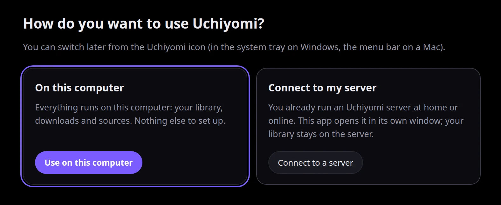
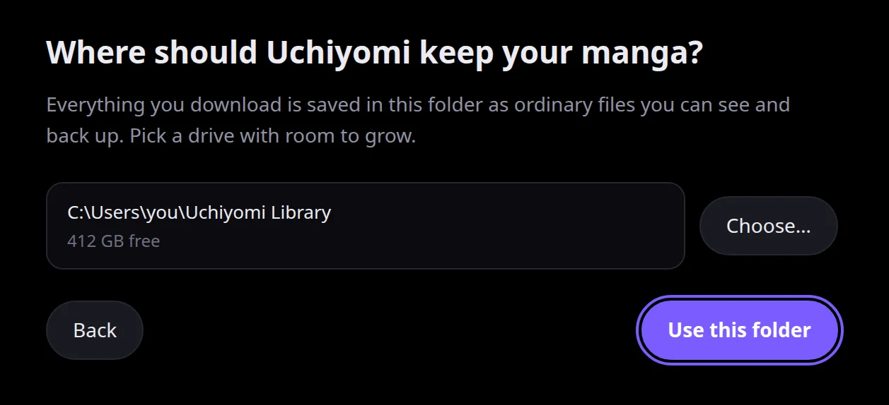
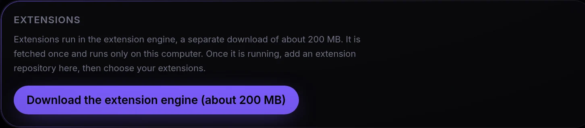
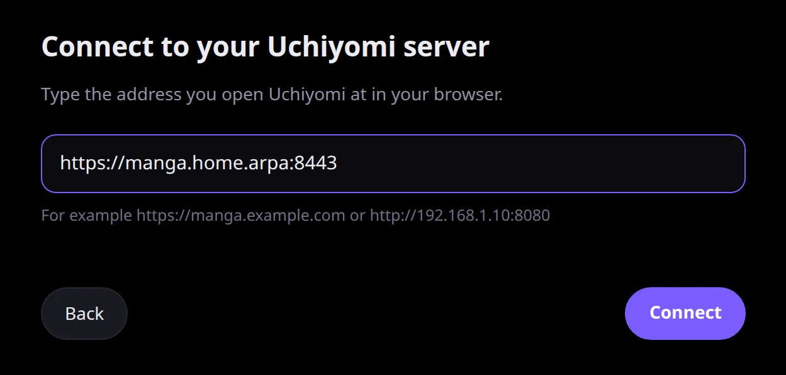
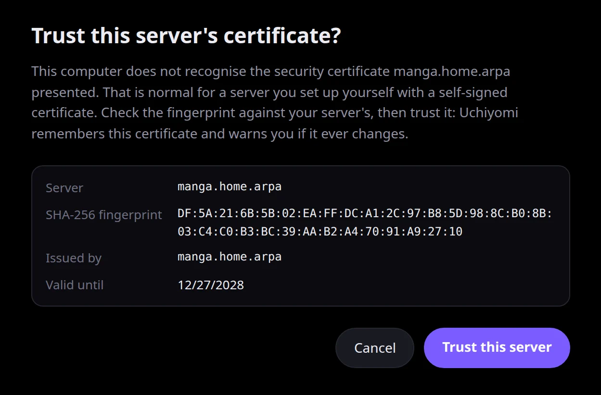
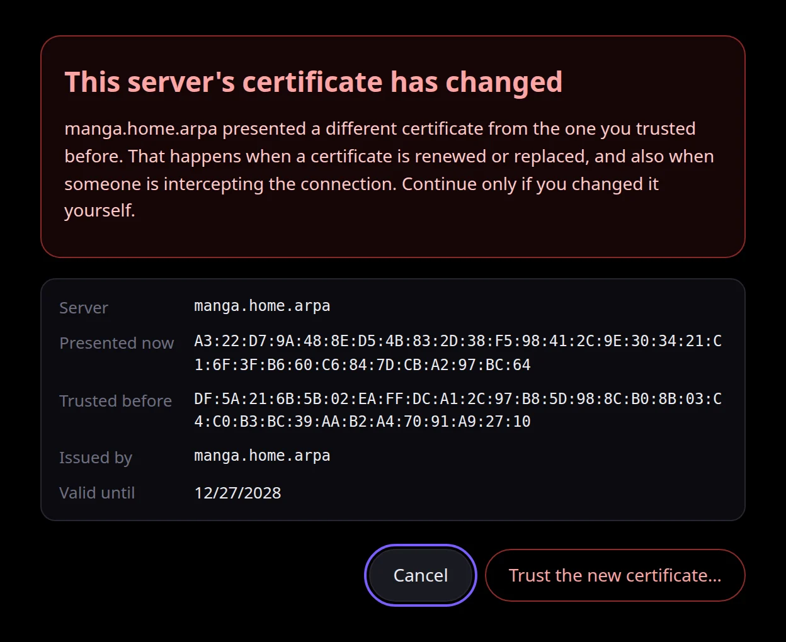
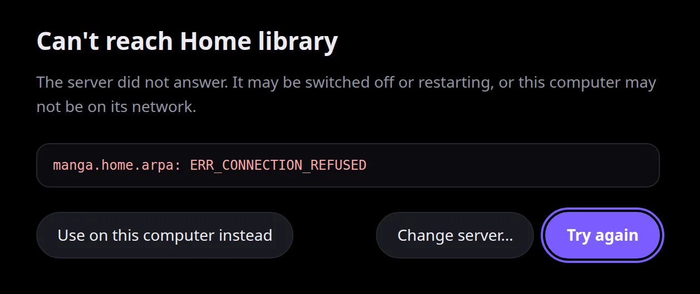

# Uchiyomi Desktop (beta)

Uchiyomi Desktop is Uchiyomi as a program for **Windows** and **Mac**. The first time you open it, it asks how
you want to use it:



| | **On this computer** | **Connect to my server** |
|---|---|---|
| Pick it when | you don't run a server and just want Uchiyomi on this PC or Mac | you already run Uchiyomi (Docker, a NAS, Unraid, Umbrel…) and want it in its own window |
| Your manga lives | in a folder on this computer | on your server, as before |
| What runs here | the whole app: its own server, database and downloads | nothing but the window |
| Signing in | never; it opens signed in | your server's own sign-in page |
| Closing the window | keeps it running in the tray or menu bar, so new chapters still arrive | quits the app |

You can switch later from the Uchiyomi icon (in the system tray on Windows, the menu bar on a Mac), and
switching never deletes anything: your library on this computer stays where it is while you use a server,
and the other way round.

It is a **beta**: first released with v0.44.0, tested on GitHub's Windows and macOS machines, not yet on many
real PCs. If something misbehaves, the logs folder ([below](#7-where-your-files-live)) is what an issue report
needs.

- [1. Download the right file](#1-download-the-right-file)
- [2. Install it and open it the first time](#2-install-it-and-open-it-the-first-time)
- [3. On this computer](#3-on-this-computer)
- [4. Connect to your own server](#4-connect-to-your-own-server)
- [5. Updates](#5-updates)
- [6. Backups and restoring them](#6-backups-and-restoring-them)
- [7. Where your files live](#7-where-your-files-live)
- [8. Uninstalling](#8-uninstalling)
- [9. If something goes wrong](#9-if-something-goes-wrong)
- [10. What the desktop app leaves out, and why](#10-what-the-desktop-app-leaves-out-and-why)

---

## 1. Download the right file

These links always lead to the newest version:

| Your computer | Download |
|---|---|
| Windows (x64) | [Uchiyomi-Setup.exe](https://github.com/AngeloSha/uchiyomi/releases/latest/download/Uchiyomi-Setup.exe) |
| Mac with Apple silicon (M1 or newer) | [Uchiyomi-mac-arm64.dmg](https://github.com/AngeloSha/uchiyomi/releases/latest/download/Uchiyomi-mac-arm64.dmg) |
| Mac with an Intel processor | [Uchiyomi-mac-x64.dmg](https://github.com/AngeloSha/uchiyomi/releases/latest/download/Uchiyomi-mac-x64.dmg) |

**Which Mac do I have?** Open the Apple menu → **About This Mac**. If it shows a line called **Chip** (Apple
M1, M2…), your Mac has Apple silicon. If it shows **Processor** with an Intel name, it is an Intel Mac.
([Apple: Mac computers with Apple silicon](https://support.apple.com/en-us/116943))

**Everything else on the release page is not for you.** Each
[release](https://github.com/AngeloSha/uchiyomi/releases/latest) also lists `.zip`, `.blockmap` and
`latest.yml` / `latest-mac.yml` files (what the app's own updater reads), the same installers again with the
version in their names (`Uchiyomi-Setup-<version>.exe`, `Uchiyomi-<version>-arm64.dmg`,
`Uchiyomi-<version>-x64.dmg` — identical files), and *Source code*. You need only the one file above.

**If a link says "Not Found"**, a new version is being published at that moment: the installers go up about
an hour after the release itself. Try again later, or pick the file from the
[releases page](https://github.com/AngeloSha/uchiyomi/releases).

**Not available:** Linux and Windows on Arm. On those, run the [Docker install](INSTALL.md), or open your
server in a browser.

**Your browser may warn you about the download.** The app is new and not signed yet, so Edge or Chrome may say
the file *isn't commonly downloaded*. Keep it: in Edge, open the **…** menu beside the download and choose
**Keep**, then **Keep anyway**
([Microsoft Q&A](https://learn.microsoft.com/en-us/answers/questions/5431212/i-receive-this-message-when-trying-to-install-offi)).

## 2. Install it and open it the first time

The app is **not signed yet** (signing certificates cost money every year, and this is a free project), so
Windows and macOS each ask once whether you trust it.

### Windows

1. Run **Uchiyomi-Setup.exe**. There is no wizard and no administrator prompt: it installs for your account
   only, into `%LOCALAPPDATA%\Programs\uchiyomi-desktop`, and opens Uchiyomi when it is done.
2. The first time, SmartScreen shows **"Windows protected your PC"**. Choose **More info**, then **Run
   anyway**. Windows shows this because the file has no download reputation yet
   ([Microsoft: SmartScreen](https://learn.microsoft.com/en-us/windows/security/operating-system-security/virus-and-threat-protection/microsoft-defender-smartscreen/)).

**Smart App Control** blocks it outright. If that is turned on, Windows refuses every unsigned program, and
Microsoft says *"There is currently no way to bypass Smart App Control protection for individual apps"*
([Microsoft: Smart App Control](https://support.microsoft.com/en-us/topic/what-is-smart-app-control-285ea03d-fa88-4d56-882e-6698afdb7003)).
On that PC, use the [Docker install](INSTALL.md) or open your server in a browser.

### macOS 15 (Sequoia) and newer

1. Open the dmg and drag **Uchiyomi** onto **Applications**.
2. Open Uchiyomi from Applications. macOS refuses the first time; choose **Done** (not *Move to Trash*).
3. Open **System Settings → Privacy & Security**, scroll down to **Security**, and click **Open Anyway**
   next to the message about Uchiyomi. The button is there for about an hour after you tried to open the app.
4. Confirm with **Open**, then your login password.

From then on it opens with a double-click. ([Apple: Open a Mac app from an unknown developer](https://support.apple.com/guide/mac-help/open-a-mac-app-from-an-unknown-developer-mh40616/mac),
[Apple: Safely open apps on your Mac](https://support.apple.com/en-us/102445))

Since macOS 15 the old shortcut, Control-click → **Open**, no longer lets an unsigned app through; the
**Open Anyway** button is the way.

### macOS 14 and older

In Finder, go to Applications, **Control-click** (or right-click) Uchiyomi, choose **Open**, then **Open** again
([Apple, macOS 14](https://support.apple.com/guide/mac-help/open-a-mac-app-from-an-unknown-developer-mh40616/14.0/mac/14.0)).
**Open Anyway** in Privacy & Security works too.

### Then: how do you want to use Uchiyomi?

The first window asks. Pick **On this computer** ([section 3](#3-on-this-computer)) or **Connect to my
server** ([section 4](#4-connect-to-your-own-server)). If you installed v0.44.0 before and chose a library
folder then, you are not asked: it opens your library on this computer as before.

---

## 3. On this computer

Everything runs on your computer: Uchiyomi's own server, its database, the downloads. There is no Docker, no
account to create and no server to keep running.

### Choose the library folder



**"Where should Uchiyomi keep your manga?"** is the folder your downloads are saved to, as ordinary files you
can see and back up. The default is `Uchiyomi Library` in your home folder (`C:\Users\<you>\Uchiyomi Library`,
`/Users/<you>/Uchiyomi Library`); **Choose…** picks another, and the free space on that drive is shown.
**Back** returns to the first question.

- It has to be a folder you can write to, and it cannot be the app's own data folder (or inside or around it), a
  drive root, or your home folder itself.
- A folder a cloud service may sync — OneDrive, Documents, iCloud Drive, the Mac Desktop, Dropbox, Google
  Drive — gets a warning, because the whole library could be uploaded, and "files on demand" placeholders fail
  to read offline. **Use it anyway** is there if you mean it.
- The choice is made once. Moving the library to another folder later is not in this version.

Then the app opens, **already signed in**, on an empty library. There is never a sign-in screen: the first start
creates one local admin account named after your computer account, with no password. The first start takes a
little longer, because the database is created then.

### Add your first sources

The library is empty until you add somewhere to get manga from. There are three ways, and you can use all of
them:

1. **MangaDex** works straight away: open **Discover**, search a title and add it.
2. **A site by its address.** **Admin → Providers** → **Add a site**: paste the site's homepage address, give it
   a name, **Add**. Uchiyomi recognises the common manga-site families by itself. Step by step:
   [the user guide, section 7](USAGE.md#add-a-site--step-by-step).
3. **Mihon / Tachiyomi extensions.** These need the **extension engine**, a separate download, then an
   extension repository:

   

   1. Open **Admin → Extensions** and choose **Download the extension engine (about 200 MB)**. (Until then the
      Extensions card under Admin → Providers says *Not installed yet — download it under Extensions*.) You
      see *Downloading the extension engine…* with how much has arrived, *Installing the extension engine…*,
      then *Starting the extension engine…*: Uchiyomi restarts its own server once to connect to it, a blink of
      two or three seconds, and reconnects by itself. The download comes from this project's own GitHub
      release for the engine, and is checked against a SHA-256 fingerprint pinned inside the app before
      anything is unpacked.
   2. **Add an extension repository** — the list of extensions someone publishes, the same address you added in
      Mihon. [Add an extension repository — step by step](extensions.md#add-an-extension-repository--step-by-step)
      explains what to paste and what each message means.
   3. **Choose extensions** from the list and press **Add** on each one you want. Hide the languages you don't
      read first (**Choose languages**): only 25 extension sources can be switched on at once, and on the desktop
      app there is no setting to raise that.

   If the download fails, *The extension engine could not be installed.* shows the reason and **Try again**.
   From then on the engine starts with Uchiyomi. It listens only on this computer, with a random password,
   and uses about 750 MB of memory while it runs (731 MiB measured on a server with 22 extensions installed).

⚠️ **Extensions that need an in-app web view do not work in the desktop app.** The extension engine can
download a browser of its own (KCEF, about 230 MB more) for the few extensions that need one; the desktop app
turns it off, because on macOS the engine crashed on every start with it on.

### Cloudflare

Sites behind Cloudflare work without anything to set up: the app has its own **Cloudflare helper**, built from
the same browser engine as the window, and both the built-in site engines and the extension engine use it.
When a site insists on a human check and you are at the computer, a window **"Uchiyomi needs you to verify
<site>"** opens after about 30 seconds; tick the box and it carries on. If you are away, the tray menu (and on a
Mac a dock badge) waits for you instead of interrupting.

In **Admin → Health** this helper is called *Cloudflare helper*. The advice there for a helper, engine or solver
problem is to quit Uchiyomi and open it again.

### The Uchiyomi icon: tray (Windows) and menu bar (Mac)

**Closing the window does not quit Uchiyomi.** It keeps running from its icon, so scheduled checks and
downloads carry on; Windows says so once, the first time. The icon's menu:

- **Open Uchiyomi**
- **Check for new chapters** — the same as the library update task; a notification confirms it started.
- **Restore a backup…** ([section 6](#6-backups-and-restoring-them))
- **Connect to my server instead…** — the server address page over the app ([section 4](#4-connect-to-your-own-server)).
  **Cancel** comes back; **Connect** saves the server and restarts Uchiyomi in it. Your library here is kept.
- when there is an update: **Restart to update to X** on Windows, **New version X — download** on a Mac
- **Start when I log in** — off by default; when on, Uchiyomi starts in the tray without opening a window.
- **Quit Uchiyomi** — stops everything in order: the server finishes the chapter it is writing, then the
  extension engine and the database shut down cleanly.

Shutting Windows down, restarting or signing out does the same ordered stop first; Windows may show
*Uchiyomi is preventing shutdown* for the second or two it takes, then carries on by itself.

The icon's own words, the first-launch pages and the dialogs follow your system's language (the same nine
languages as the app).

### How it differs from a server underneath

- **Schedules start sooner.** A computer is switched off and on far more than a server, so the first run of
  each job after a start comes sooner: the new-chapter check and the extension check after 2 minutes, the
  Cloudflare helper check after 1, the repair, read-chapter clean-up and import clean-up after 5, and the
  daily source check 24 hours after its last run (at least 5 minutes after start). A server keeps its 10 to
  30 minutes. After the computer sleeps, those other jobs can run one interval late; only the backup re-aims.
- **Room.** Downloads stop when the library's drive has less than **5 GB** free (a server keeps 10), and the
  image cache is capped at **4 GB** (16 on a server).
- **Windows-safe folder names** (Windows only): a series folder loses control characters and trailing dots and
  spaces, and the names Windows reserves — `CON`, `PRN`, `AUX`, `NUL`, `COM0`–`COM9`, `LPT0`–`LPT9`, also with
  an extension — get a `_` (`CON` becomes `CON_`). A custom site's name is treated the same when it becomes the
  source folder.
- **Case-insensitive disks** (NTFS, APFS): adding a series whose folder already exists in another case reuses
  that folder; folders typed in **Admin → Library** and rename destinations take the spelling already on disk;
  a case-only rename (*Title* → *title*) works; on Windows a typed `\` is a folder separator.
- **Antivirus.** On Windows a download retries, for about a second and a half, a rename that a virus scanner
  briefly blocks.
- **Messages that talk about Docker on a server** (a container, `PUID`, `shm_size`, `SUWAYOMI_MAX_SOURCES`) say
  what to do on a computer instead: which folder cannot be written and how to fix its permissions, to quit and
  reopen Uchiyomi, or to hide the languages you don't read.

**It is local, on purpose.** Its server listens on `127.0.0.1` only, so nothing on your network can reach it
and the firewall never asks. It also refuses a request whose `Host` is not its own address (the defence
against DNS rebinding), and ignores forwarded-for headers. No Wi-Fi does not mean "offline" here: the library
is on this computer, so the app never switches to its offline mode; while its server restarts, it waits and
retries.

---

## 4. Connect to your own server

If you already run Uchiyomi — on a NAS, a home server, Unraid, Umbrel, a VPS — the app can simply be a window
onto it. Nothing runs on this computer: no database, no downloads, no extension engine. Your library, your
accounts and your settings stay on the server, exactly as in a browser.

### Connecting



1. On the first question, choose **Connect to a server**.
2. Type the address you open Uchiyomi at in your browser — for example `https://manga.example.com` or
   `http://192.168.1.10:8080` — and choose **Connect**.
3. Uchiyomi checks that an Uchiyomi server answers there (*Connecting…*), says **Connected to** and your
   server's name, and opens it. Sign in on your server's own page, as in a browser.

What the address may be:

- **Just the address, no path.** Uchiyomi has to be at the root of its address: an address with a path (like
  `https://example.com/manga`) is not supported, and a path you type is dropped.
- **No `https://` typed?** Uchiyomi tries `https://`. If your server's address starts with `http://`, type it in
  full.
- **Plain `http://` works,** with one note shown under the field: *Over plain http, chapters cannot be saved for
  offline reading. An https address is recommended.* (Browsers only allow offline storage over https; the same
  is true in a browser.)
- **The address your server redirects to.** If `http://` sends you on to `https://` (or to another port) on
  the same name, the final address is the one saved, and **Connected to** shows it. If it sends you to
  **another name**, Uchiyomi shows that address — *{address} sent Uchiyomi on to {new address}. Continue only
  if that is your server.* — and waits for **Continue**.
- The computer has to be able to reach the server: the same network, or your VPN (Tailscale, WireGuard…).

It works with any Uchiyomi server from v0.5.0 on. A server on **v0.45.0 or newer** also hides its *Install
Uchiyomi* row inside the app, where installing it as a web app makes no sense.

**What the messages mean:**

| You see | What to do |
|---|---|
| *That doesn't look like a web address…* | Type it the way you would in a browser, like `https://manga.example.com`. |
| *Only http:// and https:// addresses work here.* | Leave out anything like `ftp://`. |
| *Leave the user name and password out of the address…* | You sign in on the server's own page, after connecting. |
| *Uchiyomi could not reach {host} ({detail})…* | Check the address, that the server is on, and that this computer is on its network or your VPN. |
| *A secure connection to {host} could not be made (…). Uchiyomi tried https://…* | You typed the address without `http://` and your server is plain http (a LAN address like `192.168.1.10:8080` usually is): type it with `http://` in front. |
| *{host} answered, but it is not an Uchiyomi server.* | The address leads to something else — often another service on the same machine, or a wrong port. |
| *That address is an Uchiyomi Desktop app, not a server…* | That is another copy of this app. Connect to your Uchiyomi server instead. |
| *{host} answered with an error (HTTP {status})…* | The server is there but unwell: is Uchiyomi running behind it? |
| *{host} asks for a password before it shows Uchiyomi…* | A password prompt on a proxy in front of the server (Basic Auth). The desktop app does not support that yet: remove it for Uchiyomi, or use a sign-in portal instead (next). |
| *{host} first sends you to a sign-in page at {portal}…* | A sign-in portal in front of the server (Authelia, Authentik and the like). If it is yours, choose **Continue** and sign in there. |
| *{host} asks you to sign in first (HTTP {status})…* | The same, from a portal that answers with 401 or 403 instead of sending you on (Authelia does this). If it is yours, choose **Continue** and sign in there. |
| *{host} sent Uchiyomi on to {address}. Continue only if that is your server.* | The address you typed redirects to another name. Choose **Continue** only if that address is yours; otherwise check what you typed. |

**Sign-in portals and single sign-on work.** The window follows your portal or identity provider and comes
back, just as a browser does; any `https://` page may open in the same window for that. Links that open a new
window go to your normal browser. A portal or identity provider on another name needs a certificate this
computer trusts (see below).

### A server with a self-signed certificate

If your server uses a certificate you made yourself, this computer does not recognise it, and Uchiyomi asks
**once**:



Check that the **SHA-256 fingerprint** is your server's before you choose **Trust this server**. On the server,
this prints the same value:

```bash
openssl x509 -in cert.pem -noout -fingerprint -sha256
```

Uchiyomi then remembers exactly that certificate for that server name and accepts nothing else in its place.
If the server ever presents a **different** certificate, you get a loud warning instead of a silent connection:



That happens when you renew or replace the certificate yourself — and also when someone is intercepting the
connection. There is no one-click way past it: **Trust the new certificate…** only arms the button, which turns
into **Yes, replace the trusted certificate**; a second, separate click (a double-click counts as one) replaces
the remembered certificate and Uchiyomi restarts. **Cancel** trusts nothing. The warning also appears while the app is open, not only at
start.

A certificate is remembered per server **name**, not per port: two services on one machine with different
self-signed certificates would warn about each other.

A certificate your computer already trusts (a real one, from Let's Encrypt for example) needs no question, and
Uchiyomi remembers that it was one. If that server later presents a certificate this computer does **not**
recognise, you get the same loud warning, with *Trusted before: A certificate this computer trusts* and no way
to trust the new one from there: a server that had a real certificate and suddenly shows a self-made one is
exactly what an interception looks like. If you really did switch it to a certificate you made yourself,
choose **Forget this server…** from the Uchiyomi icon, then connect again.

Only your server's own certificate is ever asked about. A page or a sign-in portal on another name (or another
port) with a certificate this computer does not trust simply does not load — Uchiyomi never offers to trust it.

### Using it

It is your server in a window: its own sign-in page, every tab you would see in a browser, your account's
settings. The window's title and the icon's tooltip are your server's name.

- **Closing the window quits Uchiyomi.** Nothing runs here to keep going; your server carries on without it.
- **Save offline works over https**, as in a browser: the chapters are kept in this app, per server. Over plain
  http it does not (see above).
- **When the server is off,** chapters you saved offline still open over https, served from what the app
  cached. When nothing was cached, you see:

  

  **Try again** once the server is back; **Change server…** to type another address; **Use on this computer
  instead** to switch to the other mode.
- **New-chapter alerts** (web push) are for browsers and phones; the desktop window has no push service, so
  **Profile → Settings → This device** says so instead of offering the switch. Your server's notification
  targets — a webhook, Home Assistant, ntfy, Discord, set up under **Admin → Settings → Notifications** — reach
  you anywhere instead.

The icon's menu in this mode:

- **Open Uchiyomi**
- **Switch server…** — the address page again. **Connect** saves the new server and restarts Uchiyomi in it;
  **Cancel** comes back.
- **Use on this computer instead** — restarts Uchiyomi on this computer, with your library there just as you
  left it. If you never chose a library folder, the folder page comes first, in this window: nothing changes
  until you choose **Use this folder** (then Uchiyomi restarts on this computer), and **Back** returns to your
  server.
- **Forget this server…** — asks *Forget {name}?*. **Forget** signs you out and removes what this app kept for
  that server on this computer: offline chapters, settings and the trusted certificate. Nothing on the server
  changes. Uchiyomi then restarts and asks how you want to use it; **On this computer** then opens the library
  you already have here, in the folder you chose for it.
- the update items ([section 5](#5-updates)), and **Quit Uchiyomi**.

*Check for new chapters*, *Restore a backup…* and *Start when I log in* are not in this menu: your server does
all of that itself. (If *Start when I log in* was already on, it stays in the menu so you can turn it off.)

Switching server keeps what the app stored for the previous one (its sign-in and offline chapters) until you
**Forget** it while connected to it.

---

## 5. Updates

The same in both modes:

- **Windows** checks one minute after starting and then every six hours, downloads a new version in the
  background, and installs it when you quit Uchiyomi — or at once from **Restart to update to X** in the icon's
  menu. In server mode, closing the window is quitting, so it installs then. Shutting Windows down or signing
  out does not install it (an installer cut off by the shutdown would leave a broken app); it waits for the next
  time you quit.
- **A Mac cannot update an unsigned app by itself.** When a new version is out, the menu-bar icon offers **New
  version X — download**, and on this computer the Version card in **Admin → Health** says *New version
  available* with a **Download** link. To install it:
  1. Quit Uchiyomi from its menu-bar icon (**Quit Uchiyomi**).
  2. Open the new dmg and drag **Uchiyomi** onto **Applications** again, replacing the old one when Finder asks.
  3. Open Uchiyomi. Your library, settings and server choice are kept: they live outside the app.

A new version may need **Open Anyway** once more on a Mac ([section 2](#macos-15-sequoia-and-newer)).

## 6. Backups and restoring them

*On this computer only* — a server backs itself up, as described in the [user guide](USAGE.md#12-backups--restore).

The app backs itself up every night, exactly as a server does, to the `backups` folder in its data folder:
one folder per run named by date and time, holding `db.sql.gz` (the whole database as plain SQL) and
`config.zip` (the settings, custom sites and art; a server writes `config.tar.gz`). The time is the backup hour
under **Admin → Settings → Updates & schedules**, 03:00 by default. A computer is not always on at 3 am, so:

- If there has never been a backup, or the last one — or the last attempt — is more than a day old, one runs
  about five minutes after Uchiyomi starts. If the computer is off then, it runs the next time Uchiyomi opens.
- After the computer wakes from sleep, the next backup is re-aimed within about a minute, so a night that was
  slept through catches up straight away.
- A failed run counts as a run: it is not retried in a loop.

**Admin → Tasks** has **Open backups folder** and **Restore a backup…**; the icon's menu has **Restore a
backup…** too. Restoring:

1. Pick the `db.sql.gz` inside the backup folder you want, and confirm.
2. Uchiyomi first saves a safety copy of what you have now to `backups/before-restore-<date>`. The nightly
   clean-up never deletes those; delete them yourself when you are happy.
3. It stops its server, replaces the database in **one transaction** (if anything goes wrong, nothing changes),
   replaces the settings from that backup's `config.zip`, and starts again. The window signs itself back in.

Your manga files are never touched by a restore. Moving a library *from a Docker server* into the desktop app
is not in this version, so a server's backup (the one with `config.tar.gz` in its folder) is refused with a
message rather than restored: its series point at the server's folders and would not find their files here.

## 7. Where your files live

| | Windows | macOS |
|---|---|---|
| The app | `%LOCALAPPDATA%\Programs\uchiyomi-desktop` | `/Applications/Uchiyomi.app` |
| Its data | `%LOCALAPPDATA%\Uchiyomi` | `~/Library/Application Support/Uchiyomi` |
| Your manga (on this computer) | the folder chosen on first run | the folder chosen on first run |

The data folder holds:

- `config/` — the settings, custom sites (`sites.json`) and art; `backups/` — the nightly backups;
- `db/pg16/` — the database (a bundled PostgreSQL 16, the same major version as the Docker image);
- `cache/`, `sources/`, and `library/` (an empty read library; see *Hidden settings* below);
- `engine/` — the extension engine's own data, kept for good (its series ids live here); `engine-runtime/` and
  `engine-tmp/` — the engine itself;
- `logs/` — `desktop.log`, `bff.log` (the server), `postgres.log`, `engine.log`;
- `electron/` — the window's own browser profile: in server mode, your sign-in and offline chapters for each
  server;
- `state.json` (the mode, the server's address, the trusted certificates, ports, the library folder, the hidden
  settings below) and `secrets.json` (the database and engine passwords).

In server mode only `logs/`, `electron/` and `state.json` are used; the rest appears once you use the app on this
computer.

On Windows, if the data folder's path has characters outside your system's code page (a user name like
`Jösé 名前`), the database and the engine's runtime move to `C:\ProgramData\Uchiyomi-<random id>\` instead
(its name is kept in `state.json` as `asciiBase`): PostgreSQL and Java cannot start from such a path. Uchiyomi
makes that folder itself, locks it to your account (plus SYSTEM and Administrators), and checks it is still
locked every time it starts. If another account can get into it, Uchiyomi refuses to start and says so rather
than run anything from it.

## 8. Uninstalling

- **Windows:** **Start → Settings → Apps → Installed apps**, find Uchiyomi, then **…** (More) → **Uninstall**
  ([Microsoft](https://support.microsoft.com/en-us/windows/uninstall-or-remove-apps-and-programs-in-windows-4b55f974-2cc6-2d2b-d092-5905080eaf98)).
  It stops the app in order first. Your data folder (`%LOCALAPPDATA%\Uchiyomi`) and your manga are kept; delete
  them yourself to remove everything, together with any `C:\ProgramData\Uchiyomi-…` folder.
- **macOS:** quit from the menu-bar icon, delete Uchiyomi from Applications, then delete
  `~/Library/Application Support/Uchiyomi` and your manga folder if you want them gone too.

Nothing on a server you connected to is touched by uninstalling.

## 9. If something goes wrong

**It won't open at all.** On Windows, check [Smart App Control](#windows); on a Mac, the
[Open Anyway step](#macos-15-sequoia-and-newer). A second copy never starts: opening Uchiyomi again brings the
running one to the front — look for its icon in the tray or menu bar.

**On this computer: "Uchiyomi could not start".** The loading page shows **Try again** and **Open the logs
folder**. The server's own log is `bff.log`; include the logs when you open an issue.

**On this computer: "Uchiyomi couldn't open your library".** The window could not sign itself in. **Try
again**; after a second failure it suggests quitting from the tray or menu-bar icon and opening it again.

**A browser pointed at the app's address** shows *"This library opens in the Uchiyomi app on this computer."*
That is on purpose: the library on this computer opens only in the app's own window.

**Server mode: it can't connect.** The message under the address says why (see the [table](#connecting)). Try
the same address in a browser on this computer: if the browser cannot open it either, the problem is the
network or the server, not the app.

**Server mode: "This server's certificate has changed".** If you just renewed or replaced the certificate,
compare the new fingerprint with `openssl` ([above](#a-server-with-a-self-signed-certificate)) and replace it.
If you did not, do not continue: something between you and the server is presenting its own certificate.

**Server mode: you want to start over.** **Forget this server…** in the icon's menu returns to the first
question with nothing kept for that server.

### Hidden settings and command-line flags

For troubleshooting only. Quit Uchiyomi from its icon first, edit `state.json` in the data folder, then open it:

| Setting | What it does |
|---|---|
| `"mode": "standalone"` / `"server"` | which way the app starts; a missing mode with no library folder asks the first-launch question |
| `"serverOrigin"`, `"serverName"` | the server it connects to in server mode, and the name shown for it |
| `"certPins": { "<host>": "AB:CD:…" }` | the certificates you trusted, one per server name (deleting one makes Uchiyomi ask again) |
| `"solverUserAgent": "native"` | the Cloudflare helper uses the app's own browser identity instead of the default, Chrome-shaped one |
| `"flaresolverrUrl": "http://host:8191/"` | use an external FlareSolverr instead of the built-in helper |
| `"readLibrary": "<folder>"` | add an existing manga folder as the read library (a server's `LIBRARY_PATH`). It must not be inside the download folder or contain it: the app refuses to start with the two nested, and says why in `bff.log` |

Command-line flags: `--data-dir=<folder>`; `--library-dir=<folder>` (answers the first-run question with "on
this computer" and that folder); `--server-url=<address>` (answers it with "connect to my server": the address is
checked first, and if that fails the address page opens with it filled in and the reason); `--hidden` (start in
the tray); `--quit-for-update` (stops a running copy in order); `--smoke` (a headless self-test that writes
`logs/smoke-result.json`). A mode already saved in `state.json` wins over `--library-dir` and `--server-url`.

## 10. What the desktop app leaves out, and why

*In server mode nothing is left out: you get whatever your server has.* On this computer, everything that exists
only for other people or other devices is hidden: it is one person on one computer, reached from nowhere else.
Its server answers *not found* for each of these, so they are gone, not just out of sight.

| Left out | Why |
|---|---|
| The sign-in screen, passwords, two-factor, sessions, **Sign out**, single sign-on, registration | Your computer account is the sign-in. The window signs itself in through a private handshake with the app; nothing else on the computer can. |
| Members, the per-library access line, the age caps per member | One person. Libraries themselves, 18+ libraries and age ratings stay. |
| OPDS, the Komga-compatible API (and its "Show missing chapters in Mihon" setting), API tokens | They exist for other devices, and this server does not listen to other devices at all. |
| Push notifications, *Install app* | The window has no push service. Notification targets — a webhook, Home Assistant, ntfy, Discord — still work, and are the way to hear about new chapters on a phone. |
| **Save offline**, *Save all offline*, the Offline tab, the Downloads settings | They copy chapters into the browser's storage, and on this computer the chapters are already on the disk. |
| The anonymous install count | Never sent from the desktop app, whatever a restored database says. |

In the admin that means no Members or Sessions tabs (a link to either opens Overview), no Sessions tile and no
member count; on the profile, no Account tab; under Settings no Downloads or This device sections; under
Connections no OPDS or API tokens (progress tracking with AniList, MyAnimeList and Kitsu stays).

If you want any of these — other people in your household, reading on a phone, OPDS readers — that is what a
server is for: run the [Docker install](INSTALL.md) on a machine that stays on, and use this app's **Connect to
my server** to read from it on the computer.
