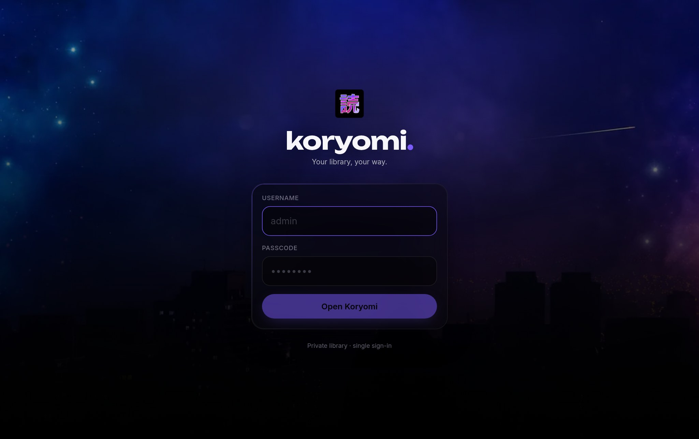
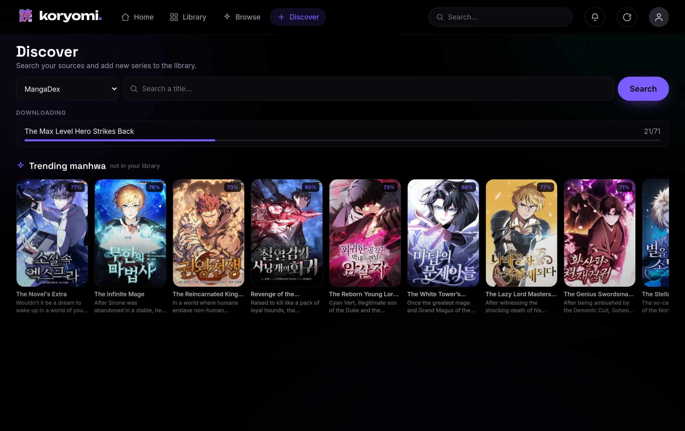
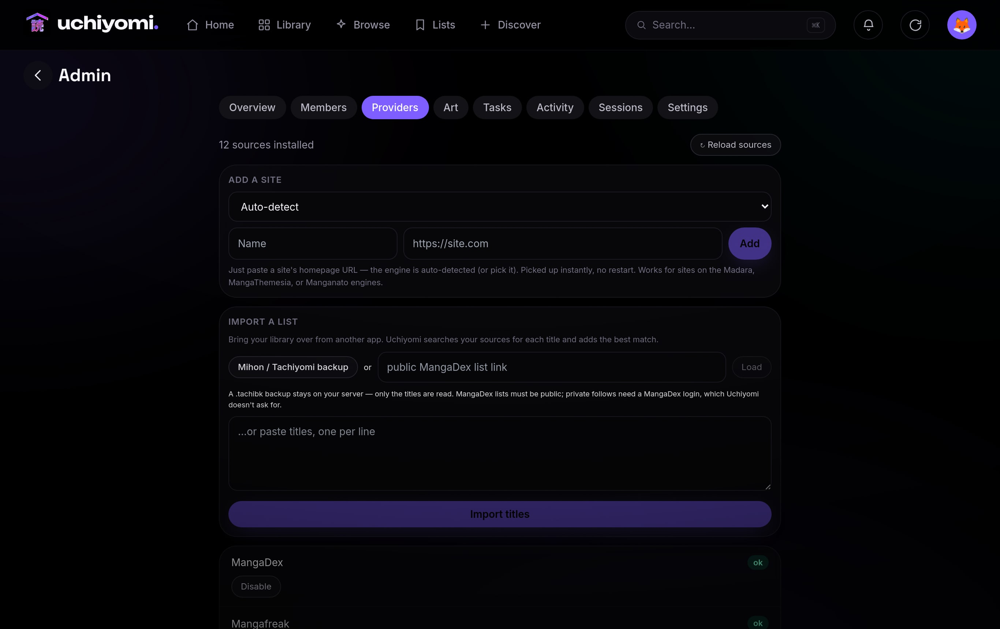
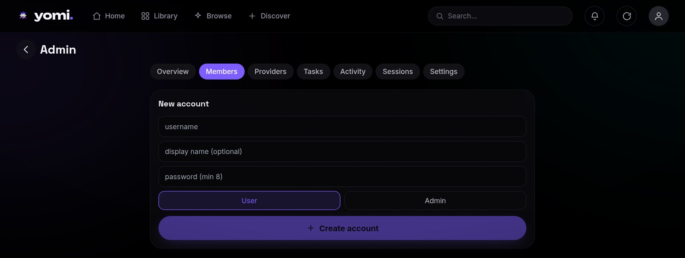
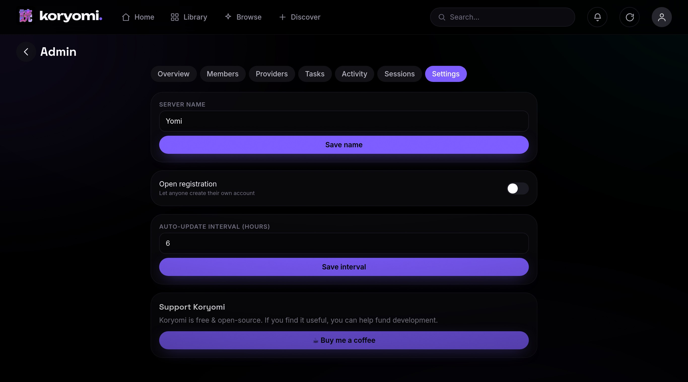
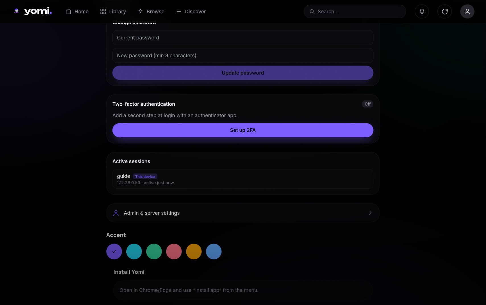

# Yomi — User Guide

Everything you can do in Yomi, screen by screen. For install/configuration see the [README](../README.md).

- [1. First run & setup](#1-first-run--setup)
- [2. Signing in](#2-signing-in)
- [3. Your library](#3-your-library)
- [4. A series & its chapters](#4-a-series--its-chapters)
- [5. The reader](#5-the-reader)
- [6. Discover & add new series](#6-discover--add-new-series)
- [7. Sources: MangaDex + Add-a-site](#7-sources-mangadex--add-a-site)
- [8. The admin panel](#8-the-admin-panel)
- [9. Security: 2FA, sessions, password](#9-security-2fa-sessions-password)
- [10. Install as an app & offline](#10-install-as-an-app--offline)

---

## 1. First run & setup

```bash
cp .env.example .env
# set your library path in .env:  LIBRARY_PATH=/path/to/your/manga   (read-only)
bash scripts/setup.sh        # generates secrets + your login password, brings the stack up
```

`setup.sh` walks you through choosing the **admin password**, generates the DB/JWT secrets, fixes volume
ownership, and starts the four containers (`yomi-web`, `yomi-bff`, `yomi-db`, `yomi-flaresolverr`). Your library
on disk should be laid out as `<series>/<chapter>`, where each chapter is a `.cbz`, a `.cbr`, or a folder of
images (an archive may carry a `ComicInfo.xml` for metadata).

Open the app at your `PUBLIC_ORIGIN` (e.g. `http://localhost:3000`).

---

## 2. Signing in



Log in with the username/password you set in `setup.sh` (the first account is `admin`). If you've turned on
two-factor auth, you'll be asked for your 6-digit code (or a recovery code) after the password.

---

## 3. Your library


The **Library** tab is your whole collection. Tabs across the top sort it — **Curated**, **Newest**, **Most
read**. Each cover shows a **NEW** ribbon when there are unread chapters. Click a cover to open the series.

The top bar has **Home** (a daily-pick hero + "For you" rails), **Library**, **Browse** (by genre), and
**Discover**, plus search, the updates bell, a refresh button, and your profile.

---

## 4. A series & its chapters


The series page shows the cover, an ambient backdrop, genres, description, and the **chapter grid**.

- **Start reading** — jumps to where you left off (or chapter 1).
- **Favorite** (heart) — adds it to your favorites + smart offline sync.
- **Download all** — saves every chapter for offline reading.
- Click any chapter to read it; the ⬇ on a chapter downloads just that one. Toggle **Oldest/Newest** to flip
  the order.

Progress, favorites, and history are **per-user** — each account has its own.

---

## 5. The reader


The centerpiece: a smooth **vertical webtoon scroll**. It auto-appends the next chapter as you near the end, so
you keep scrolling through a series without interruption.

- **Tap** the middle to show/hide the chrome (top bar + controls).
- **Pinch / double-tap** to zoom (width multiplier).
- **Themes** — AMOLED black, sepia, or gray, from the reader settings.
- **Per-series memory** — your zoom/theme choices are remembered per title.
- **Desktop** — use `[` / `]` (or the chapter dropdown) to move between chapters; the page is centered with
  comfortable margins.

It remembers your scroll position, so closing and reopening drops you right back where you were.

---

## 6. Discover & add new series



**Discover** is how you add new series to your library.

- **Trending** rail — popular manhwa you don't already have. Each card shows the description + chapter count.
- **Search** — pick a source, type a title. Results you already own are marked **✓ In library**.
- **Find & add** — tapping a trending card searches every installed source and shows which ones carry it
  (Aqua-style preferred sources first). Pick a provider, choose **how many chapters** to download (All or first
  N), toggle **auto-update**, and add it. It downloads chapter 1 immediately so the series shows up right away,
  then grabs the rest in the background (with a progress bar).

If you try to add a title you already have from another source, Yomi warns you and lets you add a separate copy
or cancel. A heads-up appears if you queue a lot of chapters at once (sources can rate-limit heavy downloads).

---

## 7. Sources: MangaDex + Add-a-site



**MangaDex works out of the box** (the official public API) — nothing to set up. Everything else you add
yourself in **Admin → Providers** by pasting a site's URL. Yomi bundles generic **engines** for three common
manga-site families — **Madara**, **MangaThemesia**, and **Manganato** — and most manga sites run one of them.

### Add a site — step by step

1. Go to **Admin → Providers** (Profile → *Admin & server settings* → **Providers** tab).
2. In the **Add a site** box, leave the engine on **Auto-detect**.
3. Paste the site's **homepage URL** — the root only, e.g. `https://some-manga-site.com`. Not a deep link to a
   specific series or chapter.
4. Type a **Name** (any label you like — it's just what shows in your source list).
5. Click **Add**. Yomi fetches the homepage, figures out the engine, and the source goes live **instantly — no
   restart**. It then appears in the list and is searchable from **Discover**.

### Will a site work?

Yomi can read a site if it runs one of the three bundled engines. You don't need to know which — Auto-detect
handles it — but here's how to recognize them by their URLs/layout:

| Engine | Tell-tale signs |
| --- | --- |
| **Madara** | A WordPress manga theme. Series pages look like `…/manga/<name>/`, chapters like `…/manga/<name>/chapter-12/`. Extremely common for manhwa/manhua. |
| **MangaThemesia** | Series at `…/manga/<name>/` or `…/series/<name>/`; the homepage is a grid of cover "cards"; the reader is one long vertical scroll. |
| **Manganato family** | Big general-manga catalogs; the search page lives at `…/search/story/<query>`. |

Not sure? Just paste the URL and add it. Worst case, Auto-detect replies that it can't tell — then you pick an
engine manually from the dropdown, or conclude the site isn't supported (next box).

### After you add a source

Open **Discover**, pick your new source in the dropdown (or use **Find & add** on a trending card), search a
title, and add it to your library — see [section 6](#6-discover--add-new-series). New sources also join the
cross-source search there automatically.

### Managing sources

Each source shows a **health** badge — `ok`, `rate-limited`, `blocked`, or `off`. From the list you can:

- **Disable** / **Enable** a source,
- **Clear** a temporary block (if a site rate-limited you after heavy downloading),
- **Remove** a site you added (the built-in MangaDex can't be removed),
- **Reload sources** — re-scan after dropping a compiled source-plugin pack into `SOURCES_DIR`.

### When a site won't work

If Auto-detect can't identify it *and* no manually-picked engine returns search results, the site runs an engine
Yomi doesn't support out of the box — typically an **API-only** site or a **JavaScript-rendered (SPA)** one.
Those need a code-level adapter (a source plugin); the three bundled engines cover the large majority of manga
sites, but not every one.

> **Cloudflare:** many sites sit behind Cloudflare. The bundled `yomi-flaresolverr` service handles that
> automatically — just make sure that container is running (it is, by default).

---

## 8. The admin panel

Reachable from **Profile → Admin & server settings** (admins only). It's a tabbed, Jellyfin-style panel.

**Overview** — library stats + recent member activity.



**Members** — create accounts (user or admin), reset passwords, and per-user controls: make admin/member,
disable, or allow/deny downloads. Each row shows whether the member has 2FA on.

**Providers** — the source health + Add-a-site controls from section 7.

**Tasks** — run the **library scan** or **check-for-new-chapters** on demand, and see when each last ran.

**Activity** — the audit feed: every login (success and failure), user change, settings change, source action.

**Sessions** — every active session across all users, with one-click revoke.



**Settings** — server name, an **open-registration** toggle (let anyone sign up), and the **auto-update
interval** (how often Yomi checks your library for new chapters).

---

## 9. Security: 2FA, sessions, password



In **Profile → Security** (every user has this):

- **Change password** — requires your current password; changing it signs out your other devices.
- **Two-factor authentication** — tap **Set up 2FA**, scan the QR with any authenticator app (Google
  Authenticator, Authy, 1Password…), enter a code to enable, and **save your recovery codes** (shown once).
  After that, logins ask for the 6-digit code. Disable it anytime by confirming your password.
- **Active sessions** — see every device you're signed in on (with IP + last-active), revoke any one, or
  **Log out others** in a single click.

Yomi also locks an account after repeated failed logins and records everything in the admin audit feed.

---

## 10. Install as an app & offline

Yomi is a **PWA** — in your browser's menu choose **Install app** (or "Add to Home Screen" on mobile) to get a
standalone, full-screen app icon.

**Offline:** favorite a series (or use **Download all** / a chapter's ⬇), and those chapters are stored on the
device for reading with no connection. The **Downloads** screen shows what's saved and a **Sync now** button;
with smart-offline on, your favorites' next unread chapters auto-download while you're online.

---

Questions or issues? Open an issue on the repo.
