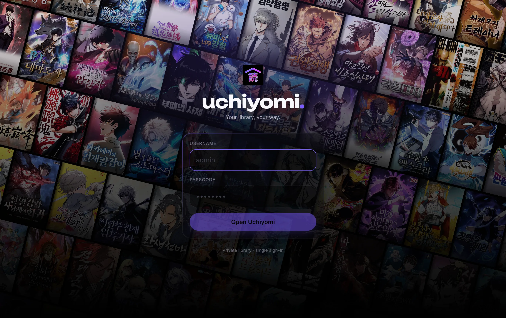
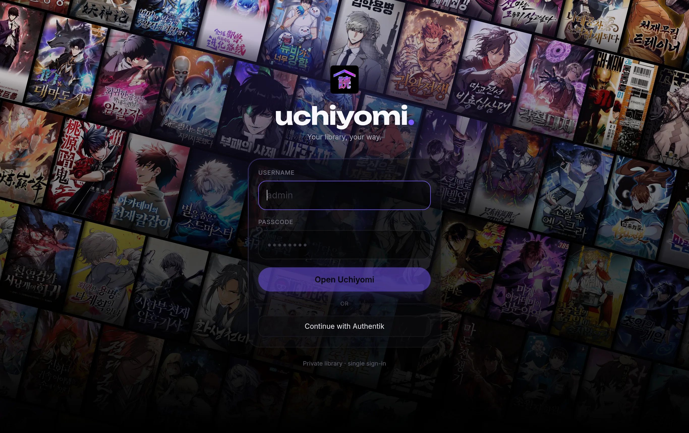
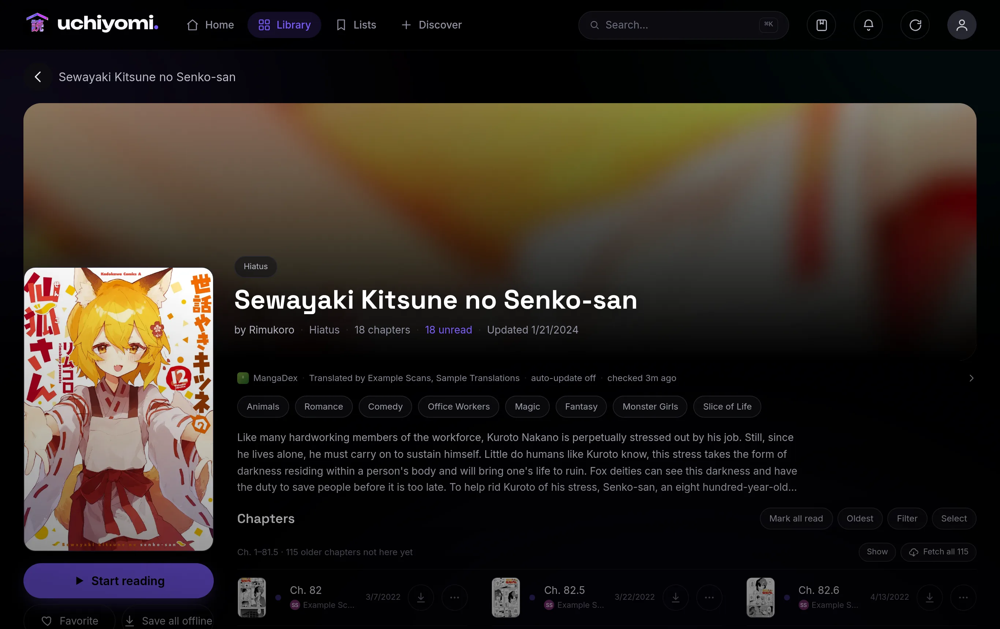
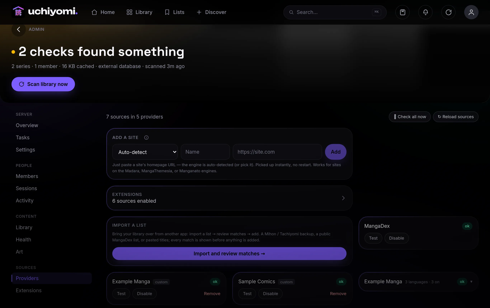
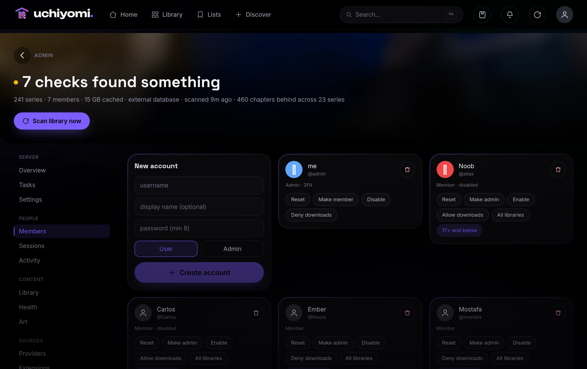
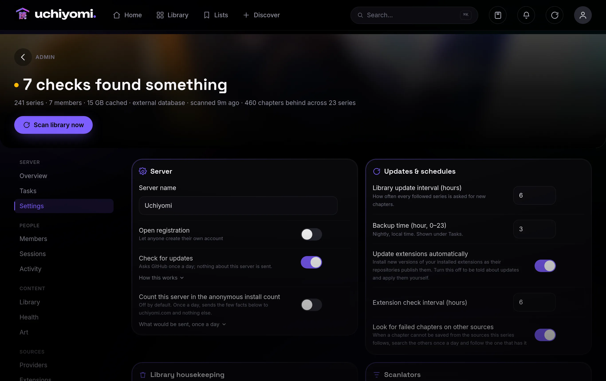
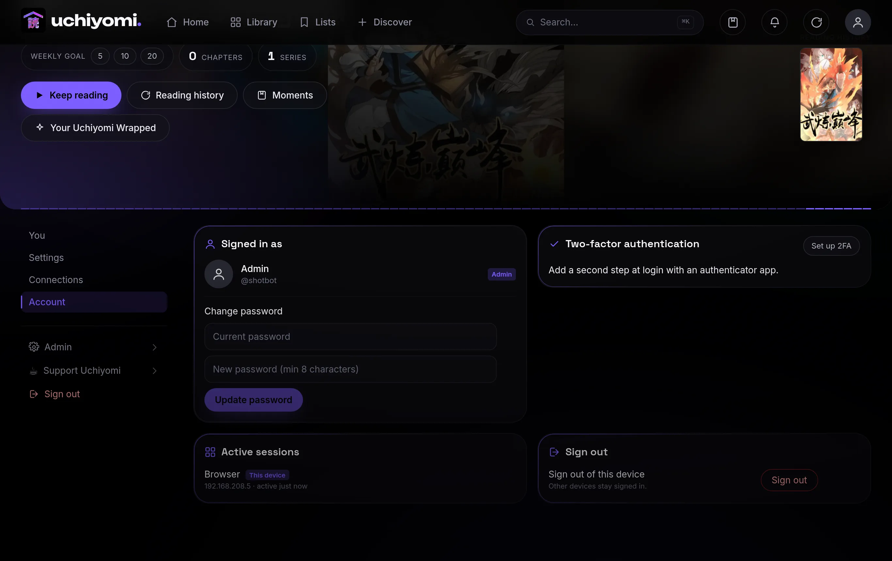
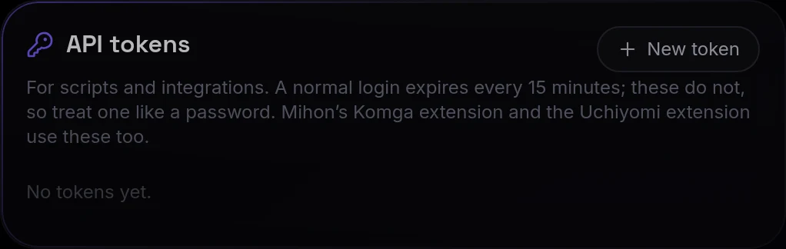

# Uchiyomi — User Guide

Everything you can do in Uchiyomi, screen by screen. For install/configuration see the [README](../README.md).

- [1. First run & setup](#1-first-run--setup)
- [2. Signing in](#2-signing-in)
- [3. Your library](#3-your-library)
- [4. A series & its chapters](#4-a-series--its-chapters)
- [5. The reader](#5-the-reader)
- [6. Discover & add new series](#6-discover--add-new-series)
- [7. Sources: MangaDex + Add-a-site](#7-sources-mangadex--add-a-site)
- [8. The admin panel](#8-the-admin-panel)
- [9. Security: 2FA, sessions, password](#9-security-2fa-sessions-password)
- [10. Tracking: AniList sync](#10-tracking-anilist-sync)
- [11. Install as an app & offline](#11-install-as-an-app--offline)
- [12. Backups & restore](#12-backups--restore)
- [13. Troubleshooting & FAQ](#13-troubleshooting--faq)

---

## 1. First run & setup

```bash
docker compose up -d         # no config needed — secrets are generated automatically
```

> **Updating later:** run `docker compose pull` *before* `docker compose up -d`. Without the pull, Docker
> keeps using the `:latest` image it already has and you stay on your installed version silently.

Open the app at your `PUBLIC_ORIGIN` (e.g. `http://localhost:3000`) and **create your admin account in the
browser** on first run (the first account created becomes the server admin). To read an existing collection,
point `LIBRARY_PATH` at it first (`cp .env.example .env`, set `LIBRARY_PATH=/path/to/your/manga`, then
`docker compose up -d`). Your library on disk should be laid out as `<series>/<chapter>`, where each chapter is a
`.cbz`, a `.cbr`, or a folder of images (an archive may carry a `ComicInfo.xml` for metadata).

Prefer a CLI-seeded admin? Run `bash scripts/setup.sh` instead — it generates the secrets, creates the admin from
a password you type, fixes volume ownership, and starts the five containers (`yomi-web`, `yomi-bff`, `yomi-db`, `yomi-suwayomi`,
`yomi-flaresolverr`).

---

## 2. Signing in



**Signing in with your own identity provider.** If the admin has configured OIDC, a **Continue with …** button
appears under the password form and you can sign in with Authentik, Authelia, Keycloak or anything else that
speaks OpenID Connect. Local accounts keep working alongside it, so a provider outage can never lock you out.
Setup is in [docs/api.md](api.md#single-sign-on-oidc).



Log in with the username/password you set in `setup.sh` (the first account is `admin`). If you've turned on
two-factor auth, you'll be asked for your 6-digit code (or a recovery code) after the password.

---

## 3. Your library


The **Library** tab is your whole collection. Tabs across the top sort it: **Curated**, **Newest**, **Most
read**. Each cover shows a **NEW** ribbon when there are unread chapters. Click a cover to open the series.

The top bar has **Home** (a daily-pick hero + "For you" rails), **Library**, **Browse** (by genre), and
**Discover**, plus search, the updates bell, a refresh button, and your profile.

---

## 4. A series & its chapters



The series page shows the cover, an ambient backdrop, genres, description, and the **chapter grid**.

- **Start reading** jumps to where you left off (or chapter 1).
- **Favorite** (heart) adds it to your favorites + smart offline sync.
- **Download all** saves every chapter for offline reading.
- Click any chapter to read it; the ⬇ on a chapter downloads just that one. Toggle **Oldest/Newest** to flip
  the order.

Progress, favorites, and history are **per-user**, so each account has its own.

---

## 5. The reader


The centerpiece: a smooth **vertical webtoon scroll**. It auto-appends the next chapter as you near the end, so
you keep scrolling through a series without interruption.

- **Tap** the middle to show/hide the chrome (top bar + controls).
- **Pinch / double-tap** to zoom (width multiplier).
- **Themes:** AMOLED black, sepia, or gray, from the reader settings.
- **Per-series memory:** your zoom/theme choices are remembered per title.
- **Desktop:** use `[` / `]` (or the chapter dropdown) to move between chapters; the page is centered with
  comfortable margins.

It remembers your scroll position, so closing and reopening drops you right back where you were.

---

## 6. Discover & add new series


**Discover** is how you add new series to your library.

- **Trending** rail: popular manhwa you don't already have. Each card shows the description + chapter count.
- **Latest on …** rails: every source gets its own row of that site's newest releases, so you can browse
  what just came out without searching. The **✦ Newest** button (next to *Browse newest from*) opens a full
  grid of one source's latest.
- **Search:** type a title once and Uchiyomi searches **all your sources at the same time**. Results are
  de-duplicated into one card per title (a small badge shows how many sources carry it), and anything you
  already own is marked **✓ In library**.
- **Add:** tap a card and pick which source to add it from (skipped when only one has it). Choose **how many
  chapters** to download (All or first N), toggle **auto-update**, and add it. It downloads chapter 1
  immediately so the series shows up right away, then grabs the rest in the background (with a progress bar).

If you try to add a title you already have from another source, Uchiyomi warns you and lets you add a separate copy
or cancel. A heads-up appears if you queue a lot of chapters at once (sources can rate-limit heavy downloads).

---

## 7. Sources: MangaDex + Add-a-site



**MangaDex works out of the box** (the official public API), with nothing to set up. Everything else you add
yourself in **Admin → Providers** by pasting a site's URL. Uchiyomi bundles generic **engines** for three common
manga-site families (**Madara**, **MangaThemesia**, and **Manganato**), and most manga sites run one of them.

### Add a site — step by step

1. Go to **Admin → Providers** (Profile → *Admin & server settings* → **Providers** tab).
2. In the **Add a site** box, leave the engine on **Auto-detect**.
3. Paste the site's **homepage URL**, the root only, e.g. `https://some-manga-site.com`. Not a deep link to a
   specific series or chapter.
4. Type a **Name** (any label you like; it's just what shows in your source list).
5. Click **Add**. Uchiyomi fetches the homepage, figures out the engine, and the source goes live **instantly, no
   restart**. It then appears in the list and is searchable from **Discover**.

### Will a site work?

Uchiyomi can read a site if it runs one of the three bundled engines. You don't need to know which (Auto-detect
handles it), but here's how to recognize them by their URLs/layout:

| Engine | Tell-tale signs |
| --- | --- |
| **Madara** | A WordPress manga theme. Series pages look like `…/manga/<name>/`, chapters like `…/manga/<name>/chapter-12/`. Extremely common for manhwa/manhua. |
| **MangaThemesia** | Series at `…/manga/<name>/` or `…/series/<name>/`; the homepage is a grid of cover "cards"; the reader is one long vertical scroll. |
| **Manganato family** | Big general-manga catalogs; the search page lives at `…/search/story/<query>`. |

Not sure? Just paste the URL and add it. Worst case, Auto-detect replies that it can't tell, and then you pick an
engine manually from the dropdown, or conclude the site isn't supported (next box).

### After you add a source

Open **Discover**, pick your new source in the dropdown (or use **Find & add** on a trending card), search a
title, and add it to your library (see [section 6](#6-discover--add-new-series)). New sources also join the
cross-source search there automatically.

### Managing sources

Each source shows a **health** badge: `ok`, `rate-limited`, `blocked`, or `off`. From the list you can:

- **Disable** / **Enable** a source,
- **Clear** a temporary block (if a site rate-limited you after heavy downloading),
- **Remove** a site you added (the built-in MangaDex can't be removed),
- **Reload sources** to re-scan after dropping a compiled source-plugin pack into `SOURCES_DIR`.

### When a site won't work

If Auto-detect can't identify it *and* no manually-picked engine returns search results, the site runs an engine
Uchiyomi doesn't support out of the box, typically an **API-only** site or a **JavaScript-rendered (SPA)** one.
Those need a code-level adapter (a source plugin); the three bundled engines cover the large majority of manga
sites, but not every one.

> **Cloudflare:** many sites sit behind Cloudflare. The bundled `yomi-flaresolverr` service handles that
> automatically; just make sure that container is running (it is, by default).

---

### Extensions (Mihon / Tachiyomi)

Beyond the built-in engines, Uchiyomi can use the **Mihon / Tachiyomi extension ecosystem** — around 1,400 of
them. Go to **Admin → Providers → Extensions**, add an extension repository you trust (once), then search and
click **Add**. Installing switches that extension's sources on straight away, so it is searchable from Discover
immediately.

Adult extensions are hidden until you tap **18+**. Full detail, including how it works and how to turn it off,
is in [docs/extensions.md](extensions.md).


## 8. The admin panel

Reachable from **Profile → Admin & server settings** (admins only). It's a tabbed, Jellyfin-style panel.

**Overview:** library stats + recent member activity.



### Health

The **Health** tab audits your library and tells you what is wrong before you run into it: series with missing
chapters, chapters that downloaded as one or two images, the same title sitting in the library twice, chapter
numbers that can't be real, and any source that is failing or blocked. Each check says what it found and what
it cannot see. Hit **Re-check** to run them again.


**Members:** create accounts (user or admin), reset passwords, and per-user controls: make admin/member,
disable, or allow/deny downloads. Each row shows whether the member has 2FA on.

**Providers:** the source health + Add-a-site controls from section 7. This tab also holds **Import a list**,
for moving a library over from another app:

- **Mihon / Tachiyomi backup** — pick your `.tachibk` (or `.proto.gz`) file. Only the titles are read; the
  file never leaves your server, and nothing about your Mihon sources or accounts is used.
- **MangaDex list** — paste the link to a **public** custom list. Private follows would need a MangaDex
  login, which Uchiyomi never asks for; make a list public and share that instead.
- **Paste titles** — one per line, from anywhere.

Whichever you use, the titles land in the box for you to review first. Anything already in your library is
removed from the list automatically, so you can delete lines you don't want before starting. Uchiyomi then
searches your configured sources for each title and adds the best match, showing live progress and a
per-title result (added / already had / not found / failed).

Importing hundreds of titles takes a while on purpose: downloads are paced so a big import doesn't hammer
the sites you're pulling from and get your server blocked.

**Tasks:** run the **library scan** or **check-for-new-chapters** on demand, and see when each last ran.

**Activity:** the audit feed, every login (success and failure), user change, settings change, source action.

**Sessions:** every active session across all users, with one-click revoke.



**Settings:** server name, an **open-registration** toggle (let anyone sign up), and the **auto-update
interval** (how often Uchiyomi checks your library for new chapters).

---

## 9. Security: 2FA, sessions, password



In **Profile → Security** (every user has this):

- **Change password:** requires your current password; changing it signs out your other devices.
- **Two-factor authentication:** tap **Set up 2FA**, scan the QR with any authenticator app (Google
  Authenticator, Authy, 1Password…), enter a code to enable, and **save your recovery codes** (shown once).
  After that, logins ask for the 6-digit code. Disable it anytime by confirming your password.
- **Active sessions:** see every device you're signed in on (with IP + last-active), revoke any one, or
  **Log out others** in a single click.

Uchiyomi also locks an account after repeated failed logins and records everything in the admin audit feed.

---

### API tokens

A normal sign-in expires every 15 minutes, which is fine for a browser and useless for a script. Under
**Profile → Security → API tokens** you can create a long-lived token instead, scoped to **read**, **write** or
**admin**, with an optional expiry. The token is shown once, so copy it then, and you can revoke it at any time.

Scopes only ever restrict: a read-only token gets a 403 on anything that changes data, and an admin-scoped
token on a non-admin account still can't reach the admin API. See [docs/api.md](api.md) for the endpoints.



## 10. Tracking: AniList sync

Connect your AniList account once under **Profile → Progress tracking** and finishing a chapter here updates
your AniList list on its own.

Paste an access token from AniList's developer settings. Progress is the highest chapter you have **finished**,
so re-reading an old chapter never rewinds your list, and AniList being slow or down can never delay or block
your reading. If your token expires or is rejected, Uchiyomi disables the connection and says so rather than
failing silently. Disconnect at any time.


## 11. Install as an app & offline

Uchiyomi is a **PWA**. In your browser's menu choose **Install app** (or "Add to Home Screen" on mobile) to get a
standalone, full-screen app icon.

**Offline:** favorite a series (or use **Download all** / a chapter's ⬇), and those chapters are stored on the
device for reading with no connection. The **Downloads** screen shows what's saved and a **Sync now** button;
with smart-offline on, your favorites' next unread chapters auto-download while you're online.

---

## 12. Backups & restore

Uchiyomi backs itself up. Every night (03:00 by default) it writes a compressed dump of the database plus an
archive of your config to `/backups`, keeping the most recent 14 runs. You can also run it on demand from
**Admin → Tasks → Backup database & config → Run now**, which shows the last run time and size.

**What's in a backup:** accounts and passwords, everyone's reading progress and history, favorites,
collections, ratings, the catalogue, your admin art overrides, and any custom sites you added.
**What isn't:** downloaded chapter files and the image cache — those are large and re-downloadable, so
including them would turn a 3 MB backup into a 70 GB one.

**Where they go.** By default a Docker volume. Point `BACKUP_PATH` at a host directory to put them somewhere
you control — ideally **a different physical disk than your Docker volumes**, so a failed drive doesn't take
the backups with it:

```
BACKUP_PATH=/mnt/backups/uchiyomi
```

The directory must be writable by uid `10002` (the app's user):
`docker run --rm -v /mnt/backups:/b alpine chown 10002:10002 /b/uchiyomi`

Tune with `BACKUP_KEEP` (how many runs to retain, default 14) and the backup hour in the database
(`server_settings.backup_hour`).

### Restoring

Each backup folder is named by timestamp and holds `db.sql.gz` and `config.tar.gz`. The dump is plain SQL, so
any `psql` can restore it — no matching tool versions required.

Restore the database into a **fresh, empty** database first and check it looks right before touching your real
one:

```
docker exec uchiyomi-bff sh -c 'gunzip -c /backups/20260819-030000/db.sql.gz' | docker exec -i -e PGPASSWORD="$DB_PASSWORD" uchiyomi-db psql -U yomi -h 127.0.0.1 -d yomi
```

Then restore the config files (custom sites, uploaded cover art, the JWT secret):

```
docker exec -i uchiyomi-bff sh -c 'tar -xzf - -C /config' < config.tar.gz
```

Restart the app afterwards (`docker compose restart uchiyomi-bff`). If you restore the database *without* the
config archive, any admin-uploaded cover art will be missing even though the database still references it.

> Container names above match `deploy/docker-compose.yml`, the recommended install. If you cloned the repo and
> run the development stack instead, the containers are `yomi-bff` / `yomi-db` — substitute accordingly.
> (The development stack also runs Postgres 15 rather than 16; the dumps are plain SQL, so they restore either
> way, but don't expect the two data directories to be interchangeable.)

> Test your restore at least once, into a scratch database, while nothing is on fire. An untested backup is
> a guess.

## 13. Troubleshooting & FAQ

**The app loads but my library is empty.** Point `LIBRARY_PATH` at your manga and restart: it mounts read-only at
`/library` and should be laid out as `<series>/<chapter>`. New or changed files are picked up by the scheduled
scan; you can also force a rescan from the admin panel, or restart the stack.

**I never set an admin password / can't sign in.** If no users exist yet, just open the app and the first-run
screen lets you create the admin. If an admin already exists, reset the password under **Profile → Security**.

**A source/site won't add.** Paste the site's **base URL** (e.g. `https://example.com`), not a series page.
Uchiyomi auto-detects the engine (Madara, MangaThemesia, Manganato); Cloudflare-protected sites are handled
automatically by the bundled FlareSolverr. A ⛔/⚠ badge on a source means it's temporarily blocked or
rate-limited — wait a bit, or try another source.

**Behind a reverse proxy, login/cookies don't stick.** Set `PUBLIC_ORIGIN` to the exact public URL you use (e.g.
`https://manga.example.com`) so cookies and CORS match, and serve it over HTTPS.

**"Install app" / Add to Home Screen isn't offered.** PWAs need a secure context: serve Uchiyomi over HTTPS (or
`http://localhost`). On iOS, use Safari → Share → Add to Home Screen.

**I lost my 2FA device.** Enter one of the recovery codes (shown when you enabled 2FA) on the login screen instead
of the 6-digit code — that is the intended way back in, so keep them somewhere that is not the phone.

If the recovery codes are gone too, the account cannot be recovered from the UI: turning 2FA off is
self-service (**Profile → Security**) and needs the account's own password, and there is deliberately no admin
override. Someone with server access can clear it directly:

```bash
docker compose exec uchiyomi-db psql -U yomi -d yomi \
  -c "UPDATE users SET totp_enabled = false, totp_secret = NULL, recovery_codes = '{}' WHERE username = 'them';"
```

(The database user and database are both `yomi` in the shipped compose files, even on the install path.)

---

Questions or issues? Open an issue on the repo.
