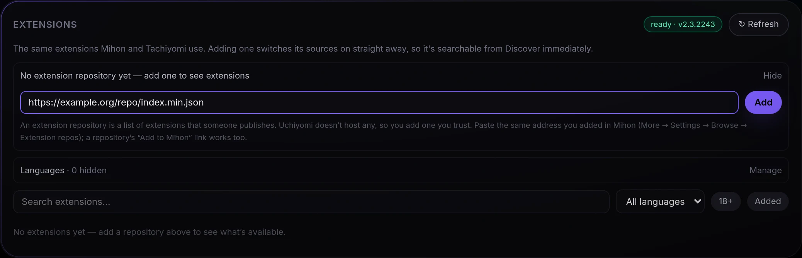
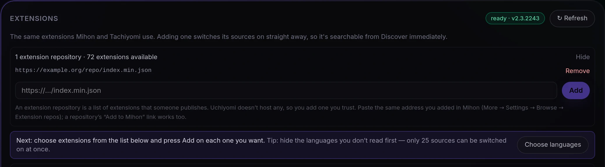

# Extensions (Mihon / Tachiyomi sources)

Uchiyomi ships **generic engines** that reach whole families of manga sites by URL, and MangaDex. On top of
that it can use the **Mihon / Tachiyomi extension ecosystem** — the same extensions those apps use, well over a
thousand of them.

Uchiyomi does not host or ship a single extension, and it has no repository built in. **You add an extension
repository you trust**, once, and from then on its extensions are listed under **Admin → Extensions**, one
**Add** each.

- [What you need first: the extension engine](#what-you-need-first-the-extension-engine)
- [Add an extension repository — step by step](#add-an-extension-repository--step-by-step)
- [Choose your extensions](#choose-your-extensions)
- [Automatic updates](#automatic-updates) · [Why there is a second container](#why-there-is-a-second-container) ·
  [How it behaves](#how-it-behaves) · [Turning it off](#turning-it-off) · [Settings](#settings)
- [Komga-compatible API](#komga-compatible-api) (Mihon reading Uchiyomi, the other direction)

## What you need first: the extension engine

Extensions run in the **extension engine**, a separate program ([why](#why-there-is-a-second-container)).
Where it comes from depends on how you run Uchiyomi:

| You run | The engine |
|---|---|
| **Docker** (the standard [`deploy/docker-compose.yml`](../deploy/docker-compose.yml), and the development stack) | Already there: the `uchiyomi-suwayomi` container starts with the rest. Nothing to set up. |
| **Uchiyomi Desktop, on this computer** | A download of about 200 MB, once: **Admin → Extensions** → **Download the extension engine (about 200 MB)**. Step by step in [the desktop guide](DESKTOP.md#add-your-first-sources). |
| **Uchiyomi Desktop, connected to your server** | Your server's. Nothing runs on the computer; the Extensions tab is the server's own. |
| **CasaOS** | Not part of that listing. **Admin → Extensions** says *No extension engine is set up for this server*; add the `uchiyomi-suwayomi` service from [`deploy/docker-compose.yml`](../deploy/docker-compose.yml) and set `SUWAYOMI_URL` ([INSTALL.md](INSTALL.md#one-click-installs)). |
| **Unraid** | Not in the template: set the advanced *SUWAYOMI_URL* to a Suwayomi server you run (and point that one at your FlareSolverr, as the template's help text says). |
| **Umbrel** | Not part of that package. |

When the engine is there, the top of **Admin → Extensions** shows a green `ready` badge with its version.
With the engine turned off on Docker (`SUWAYOMI_URL` empty) the tab says so and how to bring it back:
*The standard Docker install runs one in the `uchiyomi-suwayomi` container. If you turned it off by emptying
SUWAYOMI_URL, put that line back in .env and run `docker compose up -d`.* A container that is set up but
stopped shows *Can't reach the extension engine…* instead.

It costs memory: about **750 MB** once running (731 MiB measured on a server with 22 extensions installed).

## Add an extension repository — step by step

**What a repository is.** An extension repository is a list of extensions that someone publishes, as a small
file on the web. Mihon, Tachiyomi's forks and Uchiyomi all read the same format, so **the repository you use in
Mihon is the one to add here**. Uchiyomi never suggests one: which repository you trust is your call.

**What its address looks like.** It usually ends in **`index.min.json`**:

```
https://example.org/repo/index.min.json
```

(`example.org` stands in for the real host.) **Where to find yours:**

- **In Mihon:** **More → Settings → Browse → Extension repos** lists the repositories you already added. Copy the
  address from there.
- **On the repository's own page:** repositories publish their address, and many have an **Add to Mihon** button.
  That button is a link like `mihon://add-repo?url=https://…/index.min.json` (or `tachiyomi://add-repo?url=…`).
  Uchiyomi understands those: copy the button's link (right-click → *Copy link*) and paste it as it is, and
  Uchiyomi takes the address out of it.

**Adding it:**

1. Open **Admin → Extensions** (`/admin/?tab=Extensions`; the Extensions card under Providers leads there too).
2. With no repository yet, the repository row is **already open**: *No extension repository yet — add one to
   see extensions*, and an address field (`https://…/index.min.json`). Later, it opens with **Manage**.

   

3. Paste the address and press **Add** (or Enter). The button reads **Checking…** and a line says *Checking the
   repository — this can take up to a minute.*: Uchiyomi has the engine read the repository and waits until its
   extensions have arrived.
4. **Added — {n} extensions from this repository** shows for a moment at the top of the window:

   

   The repository appears in the row, and a line under it says what to do next:

   

   The number is what **this** repository brought — not the size of the whole list, which also counts any
   repositories you added before.

**Later, the address in the list may change.** Right after the add, the list shows exactly what you pasted. After
the extension engine restarts, it may show `…/repo.json` (or `index.pb`) instead of the `index.min.json` you
pasted. It is the same repository. Uchiyomi treats both addresses as one repository, so it is never added twice.
On the desktop app the engine restarts each time the app starts.

**What you can paste:**

| Paste | Uchiyomi |
|---|---|
| `https://…/index.min.json` | the address as it is |
| an *Add to Mihon* link, `mihon://add-repo?url=…` or `tachiyomi://add-repo?url=…`, or a web link ending in `/add-repo?url=…` | takes out the address after `url=` |
| an address without `https://` | adds `https://` |
| a link to one file on GitHub, `…/blob/<branch>/index.min.json` | turns it into the raw file's address |
| a GitHub **repository page** (`https://github.com/<owner>/<name>`) | refuses it: that is a web page, not the list itself |

The extension engine reads a repository's list only from a file named `index.min.json`. So if an `index.json`
address gives nothing, Uchiyomi tries the `index.min.json` beside it once. If a folder address gives nothing, it
tries `<folder>/index.min.json`. When the second address is the one that worked, the message adds *· saved as
index.min.json*. An `index.min.json` that gives nothing is not retried at another address.

**What each message means.** A refusal is shown in the message and also stays in red under the field until you
change the address.

| Message | Meaning |
|---|---|
| *Added — {n} extensions from this repository* | It worked. Next, [choose your extensions](#choose-your-extensions). |
| *That doesn’t look like a repository address. It usually ends in index.min.json.* | Not a web address at all, or not http/https. |
| *That is a GitHub page, not the repository itself. Paste the repository’s index.min.json link instead.* | You pasted the project's page. Uchiyomi never guesses which branch holds the file; find the `index.min.json` link (often behind the *Add to Mihon* button). |
| *That repository is already added.* | It is in the list already. Case, `http`/`https`, a trailing slash or the file name at the end make no difference to this check. |
| *That address gave no extensions, so it was not kept. Check that it is the repository’s index.min.json link, not a web page — or it may only list extensions you already have.* | The engine read the address and nothing new arrived. **It was not saved**, so there is nothing to remove. If the engine gave a reason, *The engine said: …* follows. Usually it gives none here: for a missing file, a host it cannot reach or a file it will not read, the engine writes the reason only to its own log. |
| *The extension engine refused that address: …* | The engine would not take the address; its reason follows. Nothing was changed. |
| *Could not reach the extension engine: …* | The engine is not running or not reachable ([what you need first](#what-you-need-first-the-extension-engine)). Nothing was changed. |

**Removing one:** open the row (**Manage**) and press **Remove** next to it: *Repository removed*. A removed
repository stays removed (before v0.45.0 the scheduled extension check could put it back). Its installed
extensions keep working until you remove them too, but they get no updates. Add the repository again and they
get updates again.

**↻ Refresh** at the top re-reads every repository: *Refreshed — {n} extensions available*.

## Choose your extensions


1. **Hide the languages you don't read first.** A multi-language extension provides one source per language,
   and adding it switches all of them on — thirty sources you will never search, each counting towards the
   limit below. **Choose languages** (on the next-step line) or **Admin → Extensions → Languages** → **Manage**
   lists every language your extensions offer with how many sources it has, how many are on, and how many of
   your series came from them. **Hide** switches that language's sources off in one go, and it stays hidden:
   the next extension you add leaves its sources in that language off (the install message says how many).
   **Show** brings them back. Series added from a hidden language stay readable but stop updating until it is
   shown again, and the Health page names them.
2. **Search and press Add.** The extension installs, its sources switch on straight away, and it is searchable
   from Discover immediately — no second step, no restart. Installed ones show **Remove**, and one with a newer
   version shows **Update** (an amber line offers **Update all** when several are out of date).
3. Adult extensions are hidden until you tap **18+**.

**Only 25 extension sources can be switched on at once** (`SUWAYOMI_MAX_SOURCES`, 25 by default), because every
one of them is searched together. If you have more switched on than that, the panel says so in an amber banner
and **Content → Health** lists it under *Extension source limit*; hiding languages is the cheap way under it. On
a Docker install, raising `SUWAYOMI_MAX_SOURCES` is the other; the desktop app has no setting for it.

## Automatic updates

Uchiyomi checks your repositories **every 6 hours** and installs new versions of the extensions you have
installed. You do not have to press anything.

The check is a task like any other: **Admin → Server → Tasks** shows when it last ran, what it did, and a
**Run now** button. You get a notification when extensions are updated, and a separate one when an update
fails — an extension whose download 404s stays on its old version, and that is worth knowing rather than
silently living with.

What it does on its own:

- **Re-reads your repositories, then updates.** This order is the whole point. The engine only recalculates
  "an update is available" when its repositories are re-read, so a check that skips that step compares
  against whatever was last fetched by hand and reliably finds nothing to do.
- **Waits for the chapter updater.** Replacing an extension while a library sweep is using it breaks that
  sweep's downloads, so updates wait for the next check instead. The panel says when it did.
- **Puts your repository list back.** The list is stored by Uchiyomi as well as by the engine, so deleting the
  engine's volume no longer silently un-configures the feature. If the volume is wiped, the check restores
  the repositories and reinstalls the extensions you had.
- **Tells you when an extension is abandoned.** An installed extension that no repository offers any more
  keeps working but will never update again. It is reported, never uninstalled — uninstalling would orphan
  every series routed through it.

What it will not do: install extensions you did not ask for, uninstall anything, or reinstall something you
removed yourself. Removing an extension in the engine's own interface is reported, not undone.

**To turn it off:** **Admin → Settings → Updates & schedules** → *Update extensions automatically*. The check still runs and
still tells you what is waiting; it just does not install anything. The **Update all** button in the
Extensions panel remains the manual path, and it now refreshes the repositories first, so it no longer says
"everything is already up to date" against a stale catalogue.

The interval is *Extension check interval* in the same place. Six hours is chosen against how often the
repositories actually move (roughly every fifteen hours); there is nothing to gain from checking every hour.

## Why there is a second container

Those extensions are Kotlin, compiled to Android bytecode and shipped as APKs. They cannot run in Uchiyomi's
Node server, and there is no converter — "porting" them would mean rewriting hundreds by hand.

[Suwayomi](https://github.com/Suwayomi/Suwayomi-Server) is the one project that solved this. It converts an
extension's Android bytecode to JVM bytecode and supplies a fake Android runtime so the extension believes it
is on a phone. What it does not supply is a browser: for the sources that need to get past Cloudflare it
leans on a FlareSolverr it has been told about, which is why the compose files point it at the bundled one
(below).

So Uchiyomi runs Suwayomi as an **extension engine** and nothing else. It starts with the rest of the stack,
Uchiyomi configures itself to talk to it, and you never open it. Uchiyomi keeps owning your library, reader,
downloads, updates, users and UI; the engine only answers "search this", "list these chapters", "give me this
chapter's pages".

The cost is honest: it is a JVM, and it uses about 750 MB of memory once running (731 MiB measured on a
server with 22 extensions installed; the desktop app caps its Java heap at 768 MB).

## How it behaves

- **Uchiyomi does the downloading.** Chapters land in your own library as CBZ files exactly like every other
  source, so there is one library, one updater and one set of files.
- **Cloudflare is the engine's problem, and the engine cannot solve it alone.** These sources never go through
  Uchiyomi's own FlareSolverr calls, because the engine, not Uchiyomi, talks to the site. But Suwayomi has no
  browser of its own: it hands challenged requests to a FlareSolverr it has been told about, and that is off
  by default. The compose files set `FLARESOLVERR_ENABLED=true` and `FLARESOLVERR_URL=http://uchiyomi-flaresolverr:8191`
  (`yomi-flaresolverr` in the development stack) on the engine's container so it shares the bundled solver.
  If you run the engine yourself, set those two on it too; otherwise every Cloudflare-protected extension
  source fails its search with `Cloudflare bypass currently disabled` and the admin Test button says so, in
  these words: *The extension engine's own Cloudflare bypass is switched off. On the Suwayomi engine's
  container (uchiyomi-suwayomi in the shipped compose files) set FLARESOLVERR_ENABLED=true and
  FLARESOLVERR_URL to the same solver address Uchiyomi uses (http://uchiyomi-flaresolverr:8191 in the
  shipped files), then recreate it. The v0.37.0 compose files already set both, so an upgrade that recreates
  the engine is the fix there.*
- **If the engine is down, Uchiyomi is fine.** It boots normally, the built-in engines keep working, the panel
  says it is unreachable, and extension-backed series simply do not update until it is back.
- **Series stay routed** by the source they came from, so the scheduled updater keeps pulling new chapters.

Two things worth knowing:

- A series added through an extension is routed using an id from the engine's own database. Wiping that
  database loses the routing for those series (they stay in your library; re-adding repairs it). Don't delete
  its volume. The scheduled check will put your repositories and your installed extensions back, but it
  cannot restore that routing — nothing outside the engine ever knew those ids.
- Every source you enable is queried on every cross-source search. Installing a handful is fine; installing
  hundreds would make search slow and hammer a lot of sites at once. `SUWAYOMI_MAX_SOURCES` (default 25) is a
  backstop, and it logs what it skipped rather than silently dropping it.

## Turning it off

On Docker: set `SUWAYOMI_URL=` (empty) in `.env` and restart the app; the Extensions tab then says no engine is
set up, and nothing else changes. To reclaim the memory as well, `docker compose stop uchiyomi-suwayomi`
(`yomi-suwayomi` in the development stack). The desktop app has no switch for it: an engine that was never
downloaded costs nothing, and one that was only runs while Uchiyomi does.

## Settings

| Variable | Default | What it does |
| --- | --- | --- |
| `SUWAYOMI_URL` | the bundled engine | Where the extension engine is. Empty turns the feature off. A trailing slash (or two), a query string or a fragment on this value is ignored; the scheme, host, port and any sub-path are what count. |
| `SUWAYOMI_USERNAME` / `SUWAYOMI_PASSWORD` | empty | Only if your engine has authentication enabled. |
| `SUWAYOMI_MAX_SOURCES` | `25` | Ceiling on how many extension sources register at once. |
| `SUWAYOMI_PAGE_CONCURRENCY` | `4` | Pages of one chapter fetched from the engine at once (1-8). The engine rate-limits the site itself, so extension downloads skip the one-at-a-time pacing that scraped sites need; a 429 from the engine drops back to one for the rest of the chapter. |
| `SOURCE_LATEST_TIMEOUT_MS` | `8000` | How long one source gets to answer "what's new" on Discover before it is given up on and marked unhealthy. A source that keeps overrunning it is diagnosed *answers, but more slowly than it is given* — since v0.37.0 by the admin *Test* button and the daily source check too, not only Discover's health view — and the fix sentence names this budget. |

The update check's own settings live in **Admin → Settings → Updates & schedules**, not here: *Update extensions
automatically* (on by default) and *Extension check interval (hours)* (6). The switch saves as it flips; the interval saves when you leave the field or press Enter, and the row says *Saved*.

**Adult sources.** Extensions declare whether they are adult, and Uchiyomi records that per source. A member
whose age limit is set below 18 cannot reach one: it is left out of their source list entirely, and the
server refuses it by id rather than relying on the app to hide it. Admins and members with no age limit are
unaffected. Sources with no such declaration — the built-in engines, source packs, custom sites — are treated
as not adult, the same way an unrated series stays visible instead of vanishing the moment a limit is set.

You can point `SUWAYOMI_URL` at a Suwayomi you already run instead of the bundled one; Uchiyomi doesn't care
whose it is.

The image is pinned rather than tracking `:stable`, because `:stable` is older than the extension API today's
repository indexes require and would show an empty catalogue.

## Komga-compatible API

The other direction, since v0.38.0: **Mihon reading Uchiyomi**, with reading progress flowing **back**. The
[Uchiyomi extension](https://github.com/AngeloSha/uchiyomi-extension) already adds your library as a source
in Mihon, Tachimanga and Suwayomi, but an extension cannot report what you read — Mihon only lets a
*tracker* do that, and its trackers are built into the app. One of them, the **Komga tracker**, binds to
the **Komga** extension and nothing else, and speaks a small, fixed set of Komga's endpoints. So
Uchiyomi now answers those endpoints (`/api/v1/*`, `/api/v2/*`), enough for the Komga extension to browse
and read the library and for the Komga tracker to sync progress in both directions, forward-only. The wire
contract is in [api.md](api.md#komga-compatible-api-mihons-komga-extension-and-tracker); this is the setup and
the limits.

### Setting Mihon up

1. In Uchiyomi, mint an API token under **Profile → Connections → API tokens → New token** (the form opens inline)
   with **read + write** — tick *Allow changes*. A read-only token browses and reads, but nothing syncs in
   either direction: Mihon retries a failed push a few times with backoff, then gives up quietly until the
   next chapter read. Tick **Include 18+ content** if you want 18+ libraries and series listed on the phone; the
   account's age limit still applies whatever the token says.
2. In Mihon, install the **Komga** extension from the extension repository you use there (it comes as three copies — *Komga*,
   *Komga (2)*, *Komga (3)* — for people with more than one server). In its settings, **Address** is your
   Uchiyomi URL exactly as you reach it — scheme, host, port, no trailing slash — and **API key** is the
   token. (Username and password are only shown while the API key field is empty; if you use them instead,
   put the token in **Password** and anything in **Username** — account passwords are refused on purpose,
   see below. Prefer the API key field: it is sent on every request, so changing the key moves the tracker
   with it, whereas the extension only presents the password after a 401, so a changed password is not
   noticed while the previous cookie is valid, up to 7 days.) The extension checks the login against the
   library list straight away.
3. Enable the Komga tracker in Mihon under **Settings → Tracking** *before* adding series. Mihon binds the
   tracker to a series when the series is added to the library; a series you added before the tracker was on
   has no link, and needs re-adding or a manual bind from its tracking sheet.

From then on, reading a chapter in Mihon marks it read in Uchiyomi for that account, and chapters read in
Uchiyomi (or on any other device) are marked read in Mihon on its next refresh of the series. Tachimanga
(iOS) runs the same Komga extension and its *enhanced tracking* is reported by a contributor to sync against
this API as well; it is closed source and was not tested here — a report either way is welcome.

### What the sync is, and is not

- **It is continuous progress, forward only.** The protocol carries one number per series: the highest
  chapter in the unbroken run of read chapters from the start. Chapters 1, 2 and 4 read reads as *2*, and
  Mihon marks everything up to it. Mihon only ever pushes a higher number, and the Komga protocol has no
  "unread" — marking a chapter unread on either side does not travel. Reads synced from the phone do not
  count towards streaks, the leaderboard or Wrapped, exactly like the app's own bulk mark-read; AniList,
  MyAnimeList and Kitsu are pushed once, only when something actually changed.
- **One Uchiyomi account per phone.** The tracker's own requests carry no credential; they ride on a cookie
  the extension's traffic leaves in the phone's cookie jar, which Android keys by host and cookie name — the
  port is ignored. Two Komga instances on one phone pointed at the same host with two accounts' tokens fight
  over that cookie, and the credential-less sync lands on whichever was minted last. With the API key field
  the cookie is re-minted whenever a request authenticates as a different token, so switching the key moves
  the tracker with it. With username/password the extension only presents the password after a 401, so a
  changed password is not noticed while the previous cookie is valid (up to 7 days) — revoke the old token,
  or use the API key field, which is sent on every request. And do not point the phone at a host where an
  untrusted service also answers: the phone's cookie jar is shared per hostname and ignores the port, so any
  service on the same hostname can plant a session cookie of its own that the tracker's credential-less
  requests would then carry; the extension re-mints the cookie on its next credentialed request, but until
  then those writes land on whoever planted it. Real Komga has both limits.
- **A real Komga on the same host coexists.** Uchiyomi's cookie is named `UCHIYOMI-SESSION`, not
  `KOMGA-SESSION`, precisely so a Komga on another port of the same machine does not overwrite it — the
  migration case. Anything else on that host also sees the cookie (it is scoped to the host, not the port),
  which is why it is a value only these routes can verify and that nothing else on the server accepts.
- **The address is the identity.** Mihon stores each series and each tracker link under the absolute URL you
  typed. Changing the address later — `http://nas:8080` to `https://nas`, say — gives every series a new
  identity in Mihon and orphans every tracker entry. Pick the address you will keep.
- **Passwords are refused, on purpose.** The extension offers username + password; here the password must be
  an API token. An account password would have walked around two-factor authentication and the lockout
  counter, and this protocol has no place to type a 2FA code. Revoking the token, letting it expire or
  disabling the account ends the phone's session on its next request.
- **What the phone sees** is what the token's account may see: library grants, the age limit and hidden
  series apply, and an 18+ library, or a series the admin's 18+ filter hides, is listed only when the token was
  minted with *Include 18+ content*
  (the extension has no reveal button of its own). Collections and read lists are always empty there, so
  that no id from a shelf the account cannot open is disclosed. Chapters deleted from the server are left
  out of the phone's chapter list but still count for progress. A fresh bind sends *0* as its progress, and
  that is treated as nothing rather than as "chapter 0 read", so a chapter numbered 0 (*Extra*, *Oneshot*,
  any file without a digit) is not marked read just by binding the series; the first real sync (n ≥ 1) marks
  a number-0 chapter read on both sides, as Komga does — only the bind-time 0 is ignored. In the other
  direction the server reports the leading run of read chapters: nothing read reports 0, and so does a run
  that ends on — or starts with an unread — number-0 chapter, so an unread *Extra* at the head keeps the run
  behind it from reaching the phone until it is read.
- Plain HTTP on a LAN works; the cookie is marked Secure only over HTTPS.

## Where the line is

Uchiyomi's code contains **no scraper, no site name, and no repository URL**. The catalogue you browse comes
from repositories *you* add, and the engine does the fetching and installing. Uchiyomi never hosts or
redistributes an extension, and ships no default repository — so nothing is fetched from anywhere until you
choose a source for it.

What you point it at, and whether that is lawful where you live, is your call and your responsibility.
